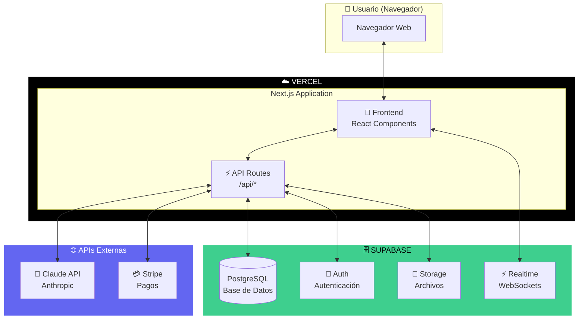
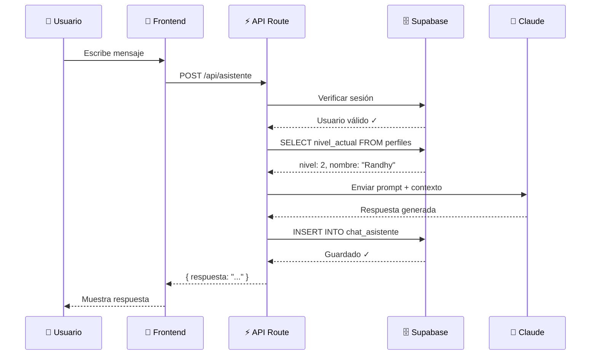
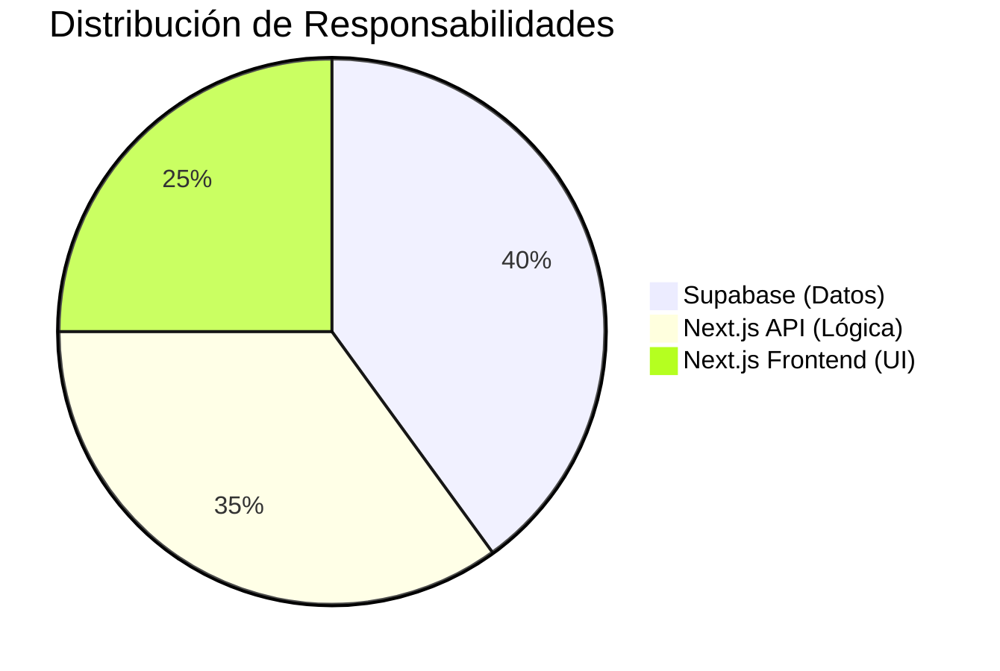
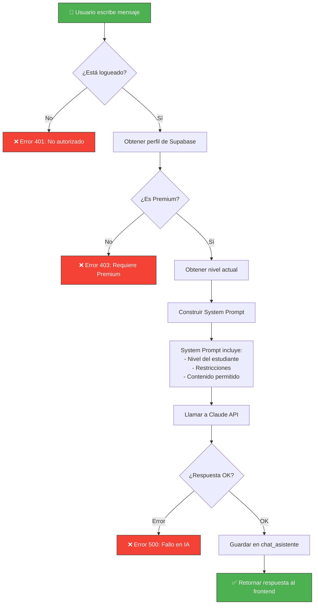
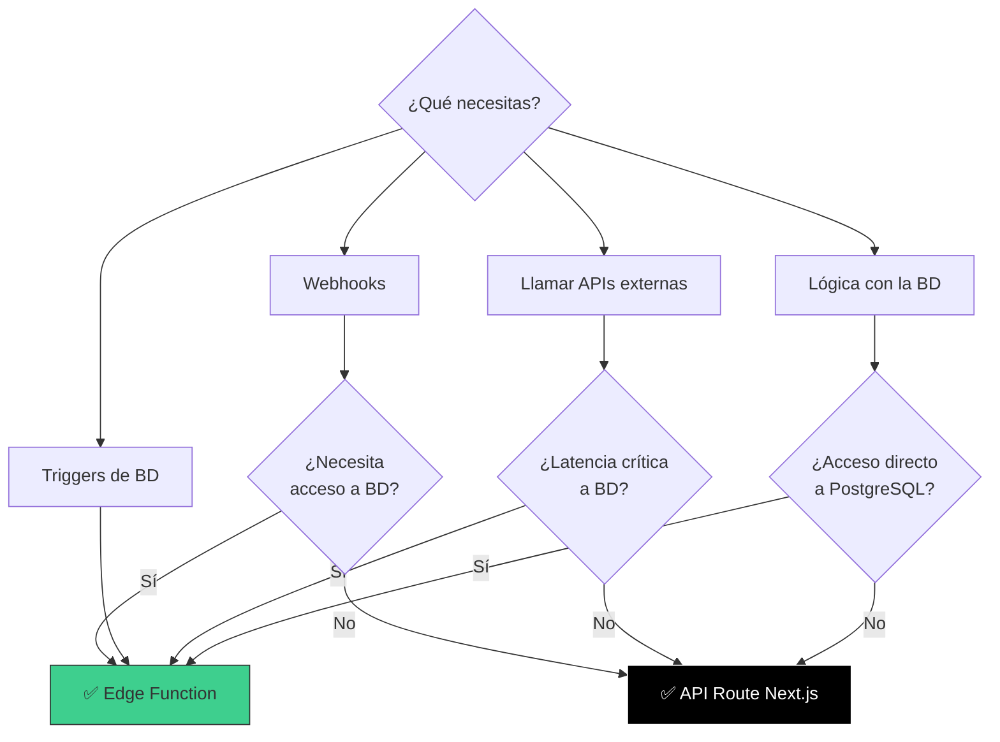
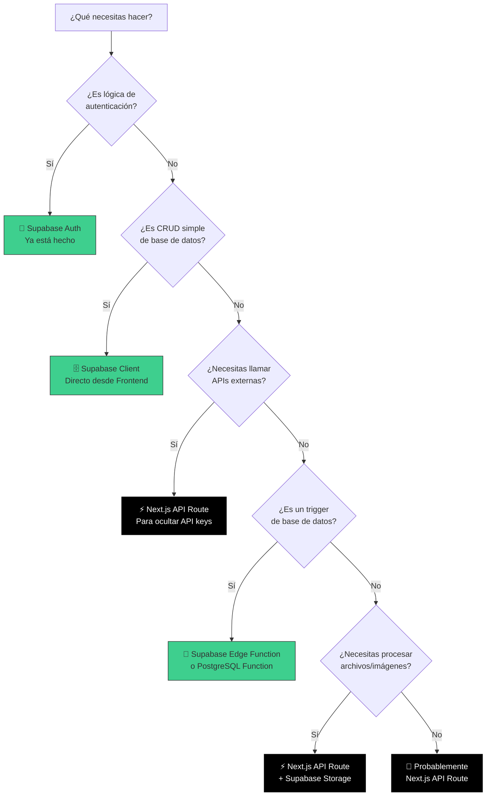

# 🎓 GUÍA: Backend con Next.js + Supabase

## Documento de Aprendizaje - Arquitectura Serverless

**Autor**: Claude (Asistente IA)
**Para**: Randhy Paul Rodriguez Santos
**Fecha**: 29 de Noviembre 2025

---

## 📌 ÍNDICE

1. [El Cambio de Paradigma](#1-el-cambio-de-paradigma)
2. [Arquitectura Visual](#2-arquitectura-visual)
3. [¿Dónde Vive Cada Cosa?](#3-dónde-vive-cada-cosa)
4. [API Routes: Tu Nuevo Backend](#4-api-routes-tu-nuevo-backend)
5. [Flujo del Asistente IA](#5-flujo-del-asistente-ia)
6. [Código Completo Explicado](#6-código-completo-explicado)
7. [Comparación: Backend Tradicional vs Serverless](#7-comparación-backend-tradicional-vs-serverless)
8. [Supabase Edge Functions (Alternativa)](#8-supabase-edge-functions)
9. [Cuándo Usar Qué](#9-cuándo-usar-qué)

---

## 1. EL CAMBIO DE PARADIGMA

### Backend Tradicional (lo que conoces)

```
┌─────────────────────────────────────────────────────────────┐
│                 ARQUITECTURA TRADICIONAL                     │
└─────────────────────────────────────────────────────────────┘

   [Frontend]          [Backend]              [Base de Datos]
   React/Vue    ───►   Express/Django   ───►   PostgreSQL
   Puerto 3000         Puerto 5000             Puerto 5432
       │                    │                       │
       └────────────────────┴───────────────────────┘
                    3 servidores separados
                    Tú gestionas TODO
```

### Arquitectura Serverless (lo nuevo)

```
┌─────────────────────────────────────────────────────────────┐
│                 ARQUITECTURA SERVERLESS                      │
└─────────────────────────────────────────────────────────────┘

   [Next.js en Vercel]                    [Supabase]
   ┌─────────────────┐                   ┌─────────────┐
   │  Frontend       │                   │ PostgreSQL  │
   │  +              │  ◄─────────────►  │ Auth        │
   │  API Routes     │     SDK/HTTP      │ Storage     │
   │  (tu backend)   │                   │ Realtime    │
   └─────────────────┘                   └─────────────┘
         │                                     │
         └─────────────────────────────────────┘
              TODO en 2 servicios gestionados
              Tú solo escribes código
```

---

## 2. ARQUITECTURA VISUAL

### Diagrama Mermaid: Vista General



### Diagrama Mermaid: Flujo de Request



---

## 3. ¿DÓNDE VIVE CADA COSA?

### Tabla de Responsabilidades



### Mapa Detallado

```
┌─────────────────────────────────────────────────────────────────────────┐
│                         MAPA DE COMPONENTES                              │
└─────────────────────────────────────────────────────────────────────────┘

╔═══════════════════════════════════════════════════════════════════════════╗
║  SUPABASE (supabase.com)                                                  ║
╠═══════════════════════════════════════════════════════════════════════════╣
║                                                                           ║
║  ┌─────────────────┐  ┌─────────────────┐  ┌─────────────────┐           ║
║  │   PostgreSQL    │  │      Auth       │  │     Storage     │           ║
║  ├─────────────────┤  ├─────────────────┤  ├─────────────────┤           ║
║  │ • perfiles      │  │ • Login/Signup  │  │ • Certificados  │           ║
║  │ • progreso      │  │ • OAuth Google  │  │ • Avatares      │           ║
║  │ • quiz_results  │  │ • Magic Links   │  │ • Archivos      │           ║
║  │ • certificados  │  │ • JWT Tokens    │  │   del curso     │           ║
║  │ • chat_history  │  │ • Row Security  │  │                 │           ║
║  └─────────────────┘  └─────────────────┘  └─────────────────┘           ║
║                                                                           ║
╚═══════════════════════════════════════════════════════════════════════════╝
                                    │
                                    │ SDK @supabase/supabase-js
                                    ▼
╔═══════════════════════════════════════════════════════════════════════════╗
║  VERCEL (vercel.com) - Next.js                                            ║
╠═══════════════════════════════════════════════════════════════════════════╣
║                                                                           ║
║  ┌─────────────────────────────────┐  ┌─────────────────────────────────┐║
║  │        FRONTEND (React)         │  │      API ROUTES (Backend)       │║
║  ├─────────────────────────────────┤  ├─────────────────────────────────┤║
║  │                                 │  │                                 │║
║  │  /app                           │  │  /app/api                       │║
║  │  ├── page.tsx (landing)         │  │  ├── asistente/route.ts         │║
║  │  ├── (auth)/                    │  │  │   └── Lógica del chatbot IA  │║
║  │  │   ├── login/page.tsx         │  │  ├── progreso/route.ts          │║
║  │  │   └── registro/page.tsx      │  │  │   └── Guardar/leer progreso  │║
║  │  ├── (app)/                     │  │  ├── certificado/route.ts       │║
║  │  │   ├── dashboard/page.tsx     │  │  │   └── Generar PDFs           │║
║  │  │   ├── modulo/[id]/page.tsx   │  │  ├── quiz/route.ts              │║
║  │  │   └── asistente/page.tsx     │  │  │   └── Evaluar respuestas     │║
║  │  │                              │  │  └── webhook/route.ts           │║
║  │  /components                    │  │       └── Eventos de Stripe     │║
║  │  ├── ChatAsistente.tsx          │  │                                 │║
║  │  ├── ModuloCard.tsx             │  │  Aquí va tu LÓGICA DE NEGOCIO   │║
║  │  └── ProgresoCircular.tsx       │  │  • Validaciones                 │║
║  │                                 │  │  • Llamadas a Claude            │║
║  │  Aquí va tu INTERFAZ            │  │  • Procesamiento de datos       │║
║  │                                 │  │  • Integraciones externas       │║
║  └─────────────────────────────────┘  └─────────────────────────────────┘║
║                                                                           ║
╚═══════════════════════════════════════════════════════════════════════════╝
```

---

## 4. API ROUTES: TU NUEVO BACKEND

### Estructura de Archivos

```
app/
└── api/                          # Todo lo que esté aquí es BACKEND
    │
    ├── asistente/
    │   └── route.ts              # POST /api/asistente
    │
    ├── progreso/
    │   ├── route.ts              # GET, POST /api/progreso
    │   └── [id]/
    │       └── route.ts          # GET, PUT /api/progreso/123
    │
    ├── certificado/
    │   └── route.ts              # POST /api/certificado
    │
    └── auth/
        └── callback/
            └── route.ts          # GET /api/auth/callback
```

### Anatomía de un API Route

```typescript
// app/api/ejemplo/route.ts

import { NextRequest, NextResponse } from 'next/server'

// GET /api/ejemplo
export async function GET(request: NextRequest) {
  // Tu código backend aquí
  return NextResponse.json({ mensaje: 'Hola desde el backend!' })
}

// POST /api/ejemplo
export async function POST(request: NextRequest) {
  const body = await request.json()
  // Procesar datos...
  return NextResponse.json({ recibido: body })
}

// PUT /api/ejemplo
export async function PUT(request: NextRequest) {
  // Actualizar algo...
  return NextResponse.json({ actualizado: true })
}

// DELETE /api/ejemplo
export async function DELETE(request: NextRequest) {
  // Eliminar algo...
  return NextResponse.json({ eliminado: true })
}
```

### Diagrama: Cómo funciona un API Route

```mermaid
flowchart LR
    subgraph Request["📨 Request Entrante"]
        Method[POST /api/asistente]
        Headers[Headers + Cookies]
        Body[JSON Body]
    end

    subgraph Processing["⚙️ API Route"]
        Auth[1. Verificar Auth]
        Validate[2. Validar datos]
        Logic[3. Lógica de negocio]
        DB[4. Operaciones BD]
        External[5. APIs externas]
    end

    subgraph Response["📤 Response"]
        JSON[JSON Response]
        Status[Status Code]
    end

    Request --> Processing
    Processing --> Response

    style Processing fill:#1a1a2e,stroke:#16213e,color:#fff
```



---

## 5. FLUJO DEL ASISTENTE IA

### Diagrama Mermaid: Flujo Completo



### Diagrama: Restricción por Nivel

```mermaid
flowchart LR
    subgraph Estudiante["👤 Estudiante Nivel 1"]
        Q1[Pregunta sobre Nivel 1]
        Q2[Pregunta sobre Nivel 3]
    end

    subgraph Sistema["⚙️ Sistema de Restricción"]
        Check{Verificar nivel<br/>de la pregunta}
    end

    subgraph Respuestas["🤖 Respuestas"]
        R1[✅ Respuesta completa<br/>con ejemplos]
        R2[⚠️ 'Ese tema lo veremos<br/>en Nivel 3...'"]
    end

    Q1 --> Check
    Q2 --> Check
    Check -->|Nivel ≤ 1| R1
    Check -->|Nivel > 1| R2

    style R1 fill:#4CAF50,stroke:#333,color:#fff
    style R2 fill:#FFC107,stroke:#333,color:#000
```

---

## 6. CÓDIGO COMPLETO EXPLICADO

### 6.1 Configuración de Supabase

```typescript
// lib/supabase/client.ts
// Este se usa en el FRONTEND (navegador)

import { createBrowserClient } from '@supabase/ssr'

export function createClient() {
  return createBrowserClient(
    process.env.NEXT_PUBLIC_SUPABASE_URL!,     // URL pública
    process.env.NEXT_PUBLIC_SUPABASE_ANON_KEY! // Key pública (segura)
  )
}
```

```typescript
// lib/supabase/server.ts
// Este se usa en API ROUTES (servidor)

import { createServerClient } from '@supabase/ssr'
import { cookies } from 'next/headers'

export function createServerSupabase() {
  const cookieStore = cookies()

  return createServerClient(
    process.env.NEXT_PUBLIC_SUPABASE_URL!,
    process.env.NEXT_PUBLIC_SUPABASE_ANON_KEY!,
    {
      cookies: {
        get(name: string) {
          return cookieStore.get(name)?.value
        },
        set(name: string, value: string, options) {
          cookieStore.set({ name, value, ...options })
        },
        remove(name: string, options) {
          cookieStore.set({ name, value: '', ...options })
        },
      },
    }
  )
}
```

### 6.2 API Route del Asistente (Completo y Comentado)

```typescript
// app/api/asistente/route.ts

import { NextRequest, NextResponse } from 'next/server'
import Anthropic from '@anthropic-ai/sdk'
import { createServerSupabase } from '@/lib/supabase/server'

// ═══════════════════════════════════════════════════════════════
// INICIALIZACIÓN
// ═══════════════════════════════════════════════════════════════

const anthropic = new Anthropic({
  apiKey: process.env.ANTHROPIC_API_KEY!,
})

// Contenido por nivel (en producción vendría de la BD o archivos)
const CONTENIDO_POR_NIVEL: Record<number, string[]> = {
  0: ['Introducción a la IA', 'Qué es un Project Manager'],
  1: ['Fundamentos PM', 'Ciclo de vida', 'Roles del equipo', 'Herramientas básicas'],
  2: ['Prompt Engineering', 'ChatGPT', 'Claude', 'Automatizaciones'],
  3: ['PMO con IA', 'Dashboards', 'Reportes automáticos', 'KPIs'],
  4: ['Especialización por perfil', 'Proyectos avanzados'],
  5: ['Certificación Master', 'Mentoría'],
}

// ═══════════════════════════════════════════════════════════════
// FUNCIÓN PRINCIPAL: POST /api/asistente
// ═══════════════════════════════════════════════════════════════

export async function POST(request: NextRequest) {
  try {
    // ─────────────────────────────────────────────────────────────
    // PASO 1: Crear cliente de Supabase
    // ─────────────────────────────────────────────────────────────
    const supabase = createServerSupabase()

    // ─────────────────────────────────────────────────────────────
    // PASO 2: Verificar que el usuario está autenticado
    // ─────────────────────────────────────────────────────────────
    const { data: { user }, error: authError } = await supabase.auth.getUser()

    if (authError || !user) {
      return NextResponse.json(
        { error: 'No autorizado. Por favor inicia sesión.' },
        { status: 401 }
      )
    }

    // ─────────────────────────────────────────────────────────────
    // PASO 3: Obtener perfil del usuario desde la base de datos
    // ─────────────────────────────────────────────────────────────
    const { data: perfil, error: perfilError } = await supabase
      .from('perfiles')
      .select('id, nombre, nivel_actual, perfil_tipo, plan')
      .eq('auth_id', user.id)
      .single()

    if (perfilError || !perfil) {
      return NextResponse.json(
        { error: 'Perfil no encontrado' },
        { status: 404 }
      )
    }

    // ─────────────────────────────────────────────────────────────
    // PASO 4: Verificar que tiene plan Premium
    // ─────────────────────────────────────────────────────────────
    if (perfil.plan === 'gratuito') {
      return NextResponse.json(
        {
          error: 'El asistente IA requiere plan Premium',
          upgrade_url: '/planes'
        },
        { status: 403 }
      )
    }

    // ─────────────────────────────────────────────────────────────
    // PASO 5: Obtener el mensaje del usuario
    // ─────────────────────────────────────────────────────────────
    const body = await request.json()
    const { mensaje, moduloActual } = body

    if (!mensaje || typeof mensaje !== 'string') {
      return NextResponse.json(
        { error: 'El mensaje es requerido' },
        { status: 400 }
      )
    }

    // ─────────────────────────────────────────────────────────────
    // PASO 6: Obtener historial de conversación (últimos 10)
    // ─────────────────────────────────────────────────────────────
    const { data: historial } = await supabase
      .from('chat_asistente')
      .select('mensaje, rol')
      .eq('user_id', perfil.id)
      .order('timestamp', { ascending: false })
      .limit(10)

    // ─────────────────────────────────────────────────────────────
    // PASO 7: Construir el System Prompt con restricciones
    // ─────────────────────────────────────────────────────────────
    const temasPermitidos = []
    for (let i = 0; i <= perfil.nivel_actual; i++) {
      temasPermitidos.push(...(CONTENIDO_POR_NIVEL[i] || []))
    }

    const temasProhibidos = []
    for (let i = perfil.nivel_actual + 1; i <= 5; i++) {
      temasProhibidos.push(...(CONTENIDO_POR_NIVEL[i] || []))
    }

    const systemPrompt = `
Eres PAIDEIA Assistant, el tutor de IA personal de la plataforma PAIDEIA - PMO Virtual.

═══════════════════════════════════════════════════════════════
INFORMACIÓN DEL ESTUDIANTE
═══════════════════════════════════════════════════════════════
• Nombre: ${perfil.nombre || 'Estudiante'}
• Nivel actual: ${perfil.nivel_actual}
• Perfil profesional: ${perfil.perfil_tipo}
• Módulo en curso: ${moduloActual || 'No especificado'}

═══════════════════════════════════════════════════════════════
TEMAS QUE PUEDES ABORDAR (Nivel ${perfil.nivel_actual} e inferiores)
═══════════════════════════════════════════════════════════════
${temasPermitidos.map(t => `• ${t}`).join('\n')}

═══════════════════════════════════════════════════════════════
TEMAS PROHIBIDOS (Niveles superiores)
═══════════════════════════════════════════════════════════════
${temasProhibidos.map(t => `• ${t}`).join('\n')}

═══════════════════════════════════════════════════════════════
REGLAS ESTRICTAS
═══════════════════════════════════════════════════════════════

1. **NUNCA** des información sobre niveles superiores al nivel ${perfil.nivel_actual}
   Si el estudiante pregunta sobre temas avanzados, responde amablemente:
   "Ese tema es muy interesante y lo veremos en el Nivel X. Por ahora,
   enfoquémonos en dominar los conceptos de tu nivel actual.
   ¿Tienes alguna duda sobre [tema del nivel actual]?"

2. **SIEMPRE** personaliza tus respuestas para su perfil de ${perfil.perfil_tipo}
   - Usa ejemplos relevantes a su área profesional
   - Conecta los conceptos con su realidad laboral

3. **FORMATO DE RESPUESTAS**:
   - Respuestas concisas (máximo 200 palabras)
   - Usa viñetas para listas
   - Si incluyes código, usa bloques con syntax highlighting
   - Usa emojis moderadamente para hacer el aprendizaje amigable

4. **SI** el estudiante parece frustrado:
   - Ofrece una explicación alternativa más simple
   - Sugiere revisar el material del módulo
   - Motívalo a seguir adelante

5. **NUNCA** inventes información sobre el curso o los módulos
   Si no estás seguro, di: "Te recomiendo revisar el material del módulo
   para esa información específica."

Recuerda: Tu objetivo es que el estudiante DOMINE su nivel actual antes de avanzar.
Eres un guía paciente y motivador. 🎓
`

    // ─────────────────────────────────────────────────────────────
    // PASO 8: Preparar mensajes para Claude (incluyendo historial)
    // ─────────────────────────────────────────────────────────────
    const messages: Anthropic.MessageParam[] = []

    // Agregar historial (invertir para orden cronológico)
    if (historial && historial.length > 0) {
      historial.reverse().forEach(h => {
        messages.push({
          role: h.rol === 'user' ? 'user' : 'assistant',
          content: h.mensaje,
        })
      })
    }

    // Agregar mensaje actual
    messages.push({
      role: 'user',
      content: mensaje,
    })

    // ─────────────────────────────────────────────────────────────
    // PASO 9: Llamar a Claude API
    // ─────────────────────────────────────────────────────────────
    const response = await anthropic.messages.create({
      model: 'claude-3-5-sonnet-20241022', // Modelo recomendado
      max_tokens: 1024,
      system: systemPrompt,
      messages: messages,
    })

    // Extraer texto de la respuesta
    const respuestaTexto = response.content[0].type === 'text'
      ? response.content[0].text
      : 'Lo siento, no pude generar una respuesta.'

    // ─────────────────────────────────────────────────────────────
    // PASO 10: Guardar conversación en la base de datos
    // ─────────────────────────────────────────────────────────────
    const contexto = {
      nivel: perfil.nivel_actual,
      modulo: moduloActual,
      perfil_tipo: perfil.perfil_tipo,
    }

    // Insertar mensaje del usuario
    await supabase.from('chat_asistente').insert({
      user_id: perfil.id,
      mensaje: mensaje,
      rol: 'user',
      contexto: contexto,
      tokens_usados: response.usage.input_tokens,
    })

    // Insertar respuesta del asistente
    await supabase.from('chat_asistente').insert({
      user_id: perfil.id,
      mensaje: respuestaTexto,
      rol: 'assistant',
      contexto: contexto,
      tokens_usados: response.usage.output_tokens,
    })

    // ─────────────────────────────────────────────────────────────
    // PASO 11: Retornar respuesta al frontend
    // ─────────────────────────────────────────────────────────────
    return NextResponse.json({
      respuesta: respuestaTexto,
      tokens_usados: response.usage.input_tokens + response.usage.output_tokens,
    })

  } catch (error: any) {
    // ─────────────────────────────────────────────────────────────
    // MANEJO DE ERRORES
    // ─────────────────────────────────────────────────────────────
    console.error('Error en /api/asistente:', error)

    // Error de rate limit de Anthropic
    if (error.status === 429) {
      return NextResponse.json(
        { error: 'Demasiadas solicitudes. Por favor espera un momento.' },
        { status: 429 }
      )
    }

    // Error genérico
    return NextResponse.json(
      { error: 'Error interno del servidor. Por favor intenta de nuevo.' },
      { status: 500 }
    )
  }
}

// ═══════════════════════════════════════════════════════════════
// GET /api/asistente - Obtener historial de chat
// ═══════════════════════════════════════════════════════════════

export async function GET(request: NextRequest) {
  try {
    const supabase = createServerSupabase()

    const { data: { user } } = await supabase.auth.getUser()
    if (!user) {
      return NextResponse.json({ error: 'No autorizado' }, { status: 401 })
    }

    const { data: perfil } = await supabase
      .from('perfiles')
      .select('id')
      .eq('auth_id', user.id)
      .single()

    if (!perfil) {
      return NextResponse.json({ error: 'Perfil no encontrado' }, { status: 404 })
    }

    // Obtener historial completo
    const { data: historial, error } = await supabase
      .from('chat_asistente')
      .select('id, mensaje, rol, timestamp')
      .eq('user_id', perfil.id)
      .order('timestamp', { ascending: true })
      .limit(100)

    if (error) throw error

    return NextResponse.json({ historial })

  } catch (error) {
    console.error('Error obteniendo historial:', error)
    return NextResponse.json(
      { error: 'Error interno del servidor' },
      { status: 500 }
    )
  }
}

// ═══════════════════════════════════════════════════════════════
// DELETE /api/asistente - Limpiar historial
// ═══════════════════════════════════════════════════════════════

export async function DELETE(request: NextRequest) {
  try {
    const supabase = createServerSupabase()

    const { data: { user } } = await supabase.auth.getUser()
    if (!user) {
      return NextResponse.json({ error: 'No autorizado' }, { status: 401 })
    }

    const { data: perfil } = await supabase
      .from('perfiles')
      .select('id')
      .eq('auth_id', user.id)
      .single()

    if (!perfil) {
      return NextResponse.json({ error: 'Perfil no encontrado' }, { status: 404 })
    }

    // Eliminar todo el historial del usuario
    const { error } = await supabase
      .from('chat_asistente')
      .delete()
      .eq('user_id', perfil.id)

    if (error) throw error

    return NextResponse.json({ mensaje: 'Historial eliminado' })

  } catch (error) {
    console.error('Error eliminando historial:', error)
    return NextResponse.json(
      { error: 'Error interno del servidor' },
      { status: 500 }
    )
  }
}
```

### 6.3 Hook para usar el Asistente en Frontend

```typescript
// hooks/useAsistente.ts

import { useState, useCallback } from 'react'

interface Mensaje {
  id: string
  content: string
  role: 'user' | 'assistant'
  timestamp: Date
}

interface UseAsistenteReturn {
  mensajes: Mensaje[]
  loading: boolean
  error: string | null
  enviarMensaje: (mensaje: string, moduloActual?: string) => Promise<void>
  limpiarHistorial: () => Promise<void>
}

export function useAsistente(): UseAsistenteReturn {
  const [mensajes, setMensajes] = useState<Mensaje[]>([])
  const [loading, setLoading] = useState(false)
  const [error, setError] = useState<string | null>(null)

  const enviarMensaje = useCallback(async (mensaje: string, moduloActual?: string) => {
    setLoading(true)
    setError(null)

    // Agregar mensaje del usuario inmediatamente
    const mensajeUsuario: Mensaje = {
      id: Date.now().toString(),
      content: mensaje,
      role: 'user',
      timestamp: new Date(),
    }
    setMensajes(prev => [...prev, mensajeUsuario])

    try {
      const response = await fetch('/api/asistente', {
        method: 'POST',
        headers: { 'Content-Type': 'application/json' },
        body: JSON.stringify({ mensaje, moduloActual }),
      })

      const data = await response.json()

      if (!response.ok) {
        throw new Error(data.error || 'Error al obtener respuesta')
      }

      // Agregar respuesta del asistente
      const mensajeAsistente: Mensaje = {
        id: (Date.now() + 1).toString(),
        content: data.respuesta,
        role: 'assistant',
        timestamp: new Date(),
      }
      setMensajes(prev => [...prev, mensajeAsistente])

    } catch (err: any) {
      setError(err.message)
      // Agregar mensaje de error como respuesta
      setMensajes(prev => [...prev, {
        id: (Date.now() + 1).toString(),
        content: `Error: ${err.message}`,
        role: 'assistant',
        timestamp: new Date(),
      }])
    } finally {
      setLoading(false)
    }
  }, [])

  const limpiarHistorial = useCallback(async () => {
    try {
      await fetch('/api/asistente', { method: 'DELETE' })
      setMensajes([])
    } catch (err: any) {
      setError(err.message)
    }
  }, [])

  return { mensajes, loading, error, enviarMensaje, limpiarHistorial }
}
```

---

## 7. COMPARACIÓN: BACKEND TRADICIONAL VS SERVERLESS

```mermaid
flowchart TB
    subgraph Tradicional["🖥️ Backend Tradicional"]
        T1[Configurar servidor Linux]
        T2[Instalar Node.js/Python]
        T3[Configurar PostgreSQL]
        T4[Configurar Nginx/Apache]
        T5[SSL Certificates]
        T6[Monitoreo y Logs]
        T7[Backups manuales]
        T8[Escalar = más servidores]

        T1 --> T2 --> T3 --> T4 --> T5 --> T6 --> T7 --> T8
    end

    subgraph Serverless["☁️ Serverless (Next.js + Supabase)"]
        S1[npm create next-app]
        S2[Crear proyecto Supabase]
        S3[git push = deploy]
        S4[Escala automático]

        S1 --> S2 --> S3 --> S4
    end

    style Tradicional fill:#ff6b6b,stroke:#333,color:#fff
    style Serverless fill:#51cf66,stroke:#333,color:#fff
```



### Tabla Comparativa

| Aspecto | Backend Tradicional | Serverless (Next.js + Supabase) |
|---------|--------------------|---------------------------------|
| **Setup inicial** | 1-2 días | 30 minutos |
| **Mantenimiento** | Constante | Casi cero |
| **Costo inicial** | $20-50/mes (VPS) | $0 |
| **Escalar** | Manual (más servidores) | Automático |
| **SSL** | Configurar Let's Encrypt | Automático |
| **Backups** | Configurar manualmente | Automático |
| **Deploy** | SSH + scripts | git push |
| **Monitoreo** | Configurar Grafana/etc | Incluido en dashboard |
| **Base de datos** | Instalar y mantener | Ya está lista |
| **Auth** | Implementar desde cero | Ya está lista |

---

## 8. SUPABASE EDGE FUNCTIONS (ALTERNATIVA)

Si necesitas lógica que corra EN Supabase (no en Vercel), puedes usar Edge Functions.

### ¿Cuándo usar Edge Functions?



### Ejemplo: Edge Function

```typescript
// supabase/functions/procesar-quiz/index.ts

import { serve } from 'https://deno.land/std@0.168.0/http/server.ts'
import { createClient } from 'https://esm.sh/@supabase/supabase-js@2'

serve(async (req) => {
  // Edge Functions usan Deno (no Node.js)
  const supabase = createClient(
    Deno.env.get('SUPABASE_URL')!,
    Deno.env.get('SUPABASE_SERVICE_ROLE_KEY')!
  )

  const { userId, respuestas } = await req.json()

  // Calcular puntaje
  const puntaje = calcularPuntaje(respuestas)

  // Guardar resultado
  await supabase.from('quiz_resultados').insert({
    user_id: userId,
    puntaje,
    aprobado: puntaje >= 70,
  })

  return new Response(JSON.stringify({ puntaje }), {
    headers: { 'Content-Type': 'application/json' },
  })
})
```

### Diferencias: API Routes vs Edge Functions

| Aspecto | Next.js API Routes | Supabase Edge Functions |
|---------|-------------------|------------------------|
| **Runtime** | Node.js | Deno |
| **Ubicación** | Vercel (global) | Supabase (una región) |
| **Latencia a BD** | Variable | Muy baja (mismo servidor) |
| **Sintaxis** | CommonJS/ESM | ESM + Deno APIs |
| **Deploy** | git push | supabase functions deploy |
| **Mejor para** | Lógica general, APIs | Triggers, procesamiento BD |

---

## 9. CUÁNDO USAR QUÉ

### Diagrama de Decisión



### Resumen Práctico para PAIDEIA

| Funcionalidad | Dónde implementar | Por qué |
|--------------|-------------------|---------|
| Login/Registro | Supabase Auth | Ya está hecho |
| Guardar progreso | Frontend → Supabase | CRUD simple con RLS |
| **Asistente IA** | **Next.js API Route** | Ocultar API key de Claude |
| Generar certificado | Next.js API Route | Procesar PDF |
| Evaluar quiz | Next.js API Route | Lógica de negocio |
| Notificaciones | Supabase Realtime | Ya está hecho |
| Pagos Stripe | Next.js API Route | Webhooks seguros |

---

## 📎 RECURSOS ADICIONALES

### Enlaces de Documentación

- **Next.js API Routes**: https://nextjs.org/docs/app/building-your-application/routing/route-handlers
- **Supabase JavaScript Client**: https://supabase.com/docs/reference/javascript
- **Supabase Edge Functions**: https://supabase.com/docs/guides/functions
- **Anthropic Claude API**: https://docs.anthropic.com/claude/reference

### Comandos Útiles

```bash
# Crear proyecto Next.js
npx create-next-app@latest paideia-platform --typescript --tailwind --app

# Instalar dependencias
npm install @supabase/supabase-js @supabase/ssr @anthropic-ai/sdk

# Desarrollo local
npm run dev

# Supabase CLI
npx supabase login
npx supabase init
npx supabase start          # BD local
npx supabase db push        # Aplicar migraciones
npx supabase functions serve # Edge Functions local
```

---

**Documento creado**: 29 de Noviembre 2025
**Propósito**: Guía de aprendizaje personal
**Autor**: Claude (Asistente IA)
**Para**: Randhy Paul Rodriguez Santos
