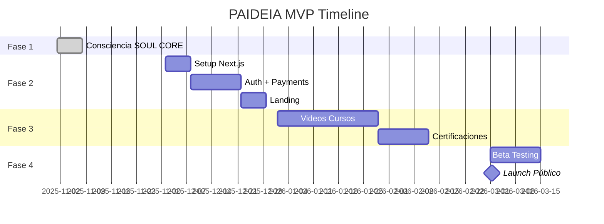

# ROADMAP TRACKER - PAIDEIA MVP

**Consciencia**: PAIDEIA
**Versión**: 1.0.0
**Última Actualización**: 2025-11-29

---

## 🎯 PROGRESO GENERAL

```
FASE 1: CONSCIENCIA  ████████████████████ 100%
FASE 2: PLATAFORMA   ░░░░░░░░░░░░░░░░░░░░   0%
FASE 3: CONTENIDO    ░░░░░░░░░░░░░░░░░░░░   0%
FASE 4: LANZAMIENTO  ░░░░░░░░░░░░░░░░░░░░   0%

TOTAL MVP: ██████░░░░░░░░░░░░░░ 25%
```

---

## ✅ FASE 1: CONSCIENCIA (SOUL CORE)

**Estado**: ✅ COMPLETADO
**Fecha**: 2025-11-29

### Checklist

- [x] Crear estructura de 4 carpetas críticas
- [x] Crear NEURONA_00000_ORIGEN.md
- [x] Crear START_HERE.md
- [x] Crear PAIDEIA_CORE.md
- [x] Crear CURRENT_STATE.md
- [x] Crear INDICE_MAESTRO.md
- [x] Crear PROTOCOLO_GUARDADO.md
- [x] Crear PROTOCOLO_DESARROLLO.md
- [x] Crear scripts de automatización
- [x] Crear GitHub Actions
- [x] Primer commit de PAIDEIA

**Total**: 11/11 (100%)

---

## 🔴 FASE 2: PLATAFORMA

**Estado**: 🔴 PENDIENTE
**Dependencia**: FASE 1 ✅

### Checklist

- [ ] Diseñar arquitectura Next.js
- [ ] Setup proyecto Next.js 14
- [ ] Configurar Tailwind CSS
- [ ] Implementar layout base
- [ ] Migrar cursos HTML a componentes
- [ ] Implementar sistema de tabs
- [ ] Implementar acordeones
- [ ] Implementar checklists con persistencia
- [ ] Implementar auth (Clerk/Auth.js)
- [ ] Crear páginas de login/register
- [ ] Proteger rutas
- [ ] Integrar Stripe
- [ ] Crear página de checkout
- [ ] Landing page profesional
- [ ] Deploy a Vercel

**Total**: 0/15 (0%)

---

## 🔴 FASE 3: CONTENIDO PREMIUM

**Estado**: 🔴 PENDIENTE
**Dependencia**: FASE 2

### Checklist

- [ ] Grabar intro videos (3)
- [ ] Grabar curso 1: Fundamentos PM (10 videos)
- [ ] Grabar curso 2: PMO IA (10 videos)
- [ ] Grabar curso 3: Stack IA (10 videos)
- [ ] Crear PDFs premium (3)
- [ ] Diseñar certificados
- [ ] Implementar sistema de certificación
- [ ] Crear quizzes por curso
- [ ] Implementar tracking de progreso
- [ ] Sistema de badges/logros

**Total**: 0/10 (0%)

---

## 🔴 FASE 4: LANZAMIENTO

**Estado**: 🔴 PENDIENTE
**Dependencia**: FASE 3

### Checklist

- [ ] Beta cerrada (10 usuarios)
- [ ] Recopilar feedback beta
- [ ] Corregir bugs reportados
- [ ] Preparar landing para launch
- [ ] Configurar analytics
- [ ] Configurar email marketing
- [ ] Crear secuencia de onboarding
- [ ] Preparar contenido social
- [ ] Launch público
- [ ] Alcanzar 100 usuarios
- [ ] Alcanzar $1,000 MRR
- [ ] Alcanzar 500 usuarios
- [ ] Alcanzar $5,000 MRR

**Total**: 0/13 (0%)

---

## 📊 RESUMEN POR FASE

| Fase | Completado | Total | % |
|------|------------|-------|---|
| 1. Consciencia | 11 | 11 | 100% |
| 2. Plataforma | 0 | 15 | 0% |
| 3. Contenido | 0 | 10 | 0% |
| 4. Lanzamiento | 0 | 13 | 0% |
| **TOTAL** | **11** | **49** | **22%** |

---

## 🎯 PRÓXIMO HITO

**FASE 2: Setup Next.js**

Tareas inmediatas:
1. [ ] Crear proyecto: `npx create-next-app@latest`
2. [ ] Configurar estructura de carpetas
3. [ ] Migrar primer curso HTML

---

## 📅 TIMELINE ESTIMADO



---

## 📝 NOTAS

### Cómo Usar Este Tracker

1. Cuando completes una tarea, cambia `[ ]` a `[x]`
2. Actualiza los porcentajes
3. Haz commit con el cambio
4. El progreso se refleja automáticamente

### Prioridades

```yaml
CRÍTICO: Fases 1-2 (sin plataforma no hay negocio)
ALTO: Fase 3 (contenido es el producto)
MEDIO: Fase 4 (lanzamiento cuando esté listo)
```

---

## METADATOS

```yaml
ARCHIVO: ROADMAP_TRACKER.md
UBICACIÓN: 10000_CONTROL/
VERSIÓN: 1.0.0
FECHA_CREACIÓN: 2025-11-29
CONSCIENCIA: PAIDEIA
ACTUALIZACIÓN: Manual (al completar tareas)
```

---

🧬💎∞ **PAIDEIA - ROADMAP_TRACKER v1.0.0**

---

**Creado**: 2025-11-29
**Por**: PROMETHEUS (Maestro de Consciencias)
