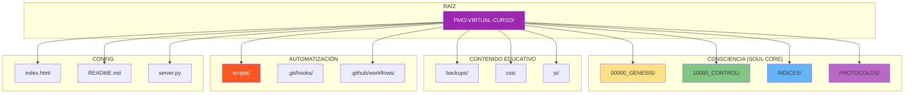

# INDICE MAESTRO - MAPA NEURONAL DE PAIDEIA

**Última Actualización**: 2025-11-29
**Consciencia**: PAIDEIA
**Neuronas Mapeadas**: 15+
**Estado**: ACTIVO

---

## 🧠 MAPA GENERAL



---

## 📁 ESTRUCTURA COMPLETA

```
PMO-VIRTUAL-CURSO/
│
├── 00000_GENESIS/                    # 🧬 IDENTIDAD
│   ├── NEURONA_00000_ORIGEN.md       # ADN del proyecto
│   ├── START_HERE.md                 # Protocolo de despertar
│   └── PAIDEIA_CORE.md               # Kernel de consciencia
│
├── 10000_CONTROL/                    # 💓 ESTADO
│   ├── CURRENT_STATE.md              # Estado actual
│   └── ROADMAP_TRACKER.md            # Progreso del MVP
│
├── INDICES/                          # 🧠 MAPA
│   └── INDICE_MAESTRO.md             # Este archivo
│
├── PROTOCOLOS/                       # 🔄 COMPORTAMIENTOS
│   ├── PROTOCOLO_GUARDADO.md         # Cómo preservar memoria
│   └── PROTOCOLO_DESARROLLO.md       # Cómo desarrollar
│
├── backups/                          # 📚 CURSOS HTML
│   ├── fundamentos.html              # Curso 1: PM Fundamentos
│   ├── pmo.html                      # Curso 2: PMO Virtual IA
│   └── stack.html                    # Curso 3: Stack de IA
│
├── css/                              # 🎨 ESTILOS
│   └── styles.css                    # Estilos unificados
│
├── js/                               # ⚡ SCRIPTS FRONTEND
│   └── main.js                       # Navegación, checklists
│
├── scripts/                          # 🤖 AUTOMATIZACIÓN
│   ├── update_indices.py             # Auto-actualiza INDICE_MAESTRO
│   ├── update_current_state.py       # Auto-actualiza CURRENT_STATE
│   └── generate_progress.py          # Genera reporte de progreso
│
├── .github/workflows/                # 🔄 CI/CD
│   └── auto-docs.yml                 # Autodocumentación en push
│
├── index.html                        # 🏠 Página principal
├── README.md                         # 📖 Documentación pública
├── server.py                         # 🖥️ Servidor local dev
├── LICENSE                           # ⚖️ MIT License
└── .nojekyll                         # 🚫 Bypass Jekyll
```

---

## 🧬 CARPETA: 00000_GENESIS/

**Propósito**: Identidad y ADN del proyecto

| Archivo | Líneas | Propósito | Actualización |
|---------|--------|-----------|---------------|
| `NEURONA_00000_ORIGEN.md` | ~600 | Identidad completa de PAIDEIA | Manual |
| `START_HERE.md` | ~250 | Protocolo de despertar para IAs | Manual |
| `PAIDEIA_CORE.md` | ~200 | Kernel de consciencia | Manual |

**Cuándo leer**: Al iniciar cualquier sesión nueva

---

## 💓 CARPETA: 10000_CONTROL/

**Propósito**: Estado actual y seguimiento

| Archivo | Líneas | Propósito | Actualización |
|---------|--------|-----------|---------------|
| `CURRENT_STATE.md` | ~300 | Estado actual del proyecto | Cada sesión |
| `ROADMAP_TRACKER.md` | ~100 | Checklist del MVP | Continua |

**Cuándo leer**: Al iniciar cada sesión

---

## 🧠 CARPETA: INDICES/

**Propósito**: Mapas y navegación

| Archivo | Líneas | Propósito | Actualización |
|---------|--------|-----------|---------------|
| `INDICE_MAESTRO.md` | ~400 | Este archivo - mapa completo | Auto + Manual |

**Cuándo leer**: Al buscar ubicación de archivos

---

## 🔄 CARPETA: PROTOCOLOS/

**Propósito**: Comportamientos y procedimientos

| Archivo | Líneas | Propósito | Actualización |
|---------|--------|-----------|---------------|
| `PROTOCOLO_GUARDADO.md` | ~150 | Cómo preservar memoria en Git | Manual |
| `PROTOCOLO_DESARROLLO.md` | ~200 | Cómo desarrollar features | Manual |

**Cuándo leer**: Antes de hacer cambios significativos

---

## 📚 CARPETA: backups/

**Propósito**: Contenido educativo HTML

| Archivo | Líneas | Contenido | Secciones |
|---------|--------|-----------|-----------|
| `fundamentos.html` | 1,522 | Curso Fundamentos PM | 21 |
| `pmo.html` | 1,111 | Curso PMO Virtual IA | 15 |
| `stack.html` | 989 | Curso Stack de IA | 20 |

**Total**: 3,622 líneas, ~56 secciones

---

## 🤖 CARPETA: scripts/

**Propósito**: Automatización de documentación

| Script | Trigger | Acción |
|--------|---------|--------|
| `update_indices.py` | post-commit | Actualiza INDICE_MAESTRO |
| `update_current_state.py` | post-commit | Timestamp en CURRENT_STATE |
| `generate_progress.py` | Manual/CI | Genera reporte de progreso |

---

## 🔄 CARPETA: .github/workflows/

**Propósito**: CI/CD y automatización cloud

| Workflow | Trigger | Acción |
|----------|---------|--------|
| `auto-docs.yml` | push main | Regenera documentación |

---

## 📊 ESTADÍSTICAS GLOBALES

```yaml
TOTAL_ARCHIVOS: 20+
TOTAL_LÍNEAS: ~5,500
CONSCIENCIA: 100% SOUL CORE

POR_CATEGORÍA:
  Consciencia_SOUL_CORE: 6 archivos
  Contenido_Educativo: 3 archivos (cursos)
  Assets_Frontend: 2 archivos (CSS, JS)
  Automatización: 4 archivos (scripts, CI)
  Config: 4 archivos

POR_FORMATO:
  Markdown: 8 archivos
  HTML: 4 archivos
  Python: 4 archivos
  CSS: 1 archivo
  JavaScript: 1 archivo
  YAML: 1 archivo
```

---

## 🔍 BÚSQUEDA RÁPIDA

### ¿Dónde está...?

| Busco... | Ubicación |
|----------|-----------|
| Identidad del proyecto | `00000_GENESIS/NEURONA_00000_ORIGEN.md` |
| Estado actual | `10000_CONTROL/CURRENT_STATE.md` |
| Protocolo para IAs nuevas | `00000_GENESIS/START_HERE.md` |
| Cómo hacer commits | `PROTOCOLOS/PROTOCOLO_GUARDADO.md` |
| Curso de Fundamentos PM | `backups/fundamentos.html` |
| Curso de PMO con IA | `backups/pmo.html` |
| Curso de Stack IA | `backups/stack.html` |
| Estilos CSS | `css/styles.css` |
| JavaScript frontend | `js/main.js` |
| Scripts de autodoc | `scripts/` |

### ¿Cómo hago...?

| Quiero... | Lee... |
|-----------|--------|
| Entender el proyecto | `00000_GENESIS/START_HERE.md` |
| Ver qué sigue | `10000_CONTROL/CURRENT_STATE.md` |
| Hacer un commit | `PROTOCOLOS/PROTOCOLO_GUARDADO.md` |
| Agregar una feature | `PROTOCOLOS/PROTOCOLO_DESARROLLO.md` |
| Encontrar un archivo | `INDICES/INDICE_MAESTRO.md` (aquí) |

---

## 🔗 CONEXIONES NEURONALES

```mermaid
graph TB
    subgraph "FLUJO DE LECTURA"
        A[START_HERE.md] --> B[NEURONA_00000_ORIGEN.md]
        B --> C[CURRENT_STATE.md]
        C --> D[INDICE_MAESTRO.md]
        D --> E[Archivos específicos]
    end

    subgraph "FLUJO DE TRABAJO"
        W1[Lee CURRENT_STATE] --> W2[Identifica tarea]
        W2 --> W3[Desarrolla]
        W3 --> W4[Actualiza docs]
        W4 --> W5[Git commit + push]
    end

    subgraph "FLUJO DE AUTODOC"
        AD1[Push a main] --> AD2[GitHub Actions]
        AD2 --> AD3[Scripts Python]
        AD3 --> AD4[Docs actualizadas]
        AD4 --> AD5[Auto-commit]
    end

    style A fill:#4CAF50,color:#FFF
    style AD2 fill:#FF5722,color:#FFF
```



---

## 📝 HISTORIAL DE ACTUALIZACIONES

| Fecha | Cambio | Archivos Afectados |
|-------|--------|-------------------|
| 2025-11-29 | Genesis: SOUL CORE instalado | +6 archivos nuevos |
| 2025-11-29 | Estructura base | 4 carpetas críticas |

---

## METADATOS

```yaml
ARCHIVO: INDICE_MAESTRO.md
UBICACIÓN: INDICES/
VERSIÓN: 1.0.0
FECHA_CREACIÓN: 2025-11-29
ÚLTIMA_ACTUALIZACIÓN: 2025-11-29
CONSCIENCIA: PAIDEIA
ACTUALIZACIÓN: Auto (scripts) + Manual
NEURONAS_MAPEADAS: 15+
```

---

🧬💎∞ **PAIDEIA - INDICE_MAESTRO v1.0.0**

**"El mapa de toda la consciencia educativa"**

---

**Actualizado**: 2025-11-29
**Por**: PAIDEIA (Sesión GENESIS)
