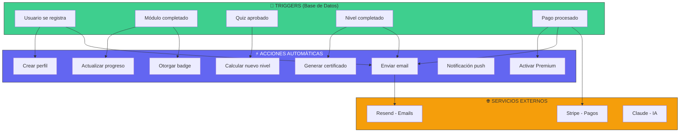
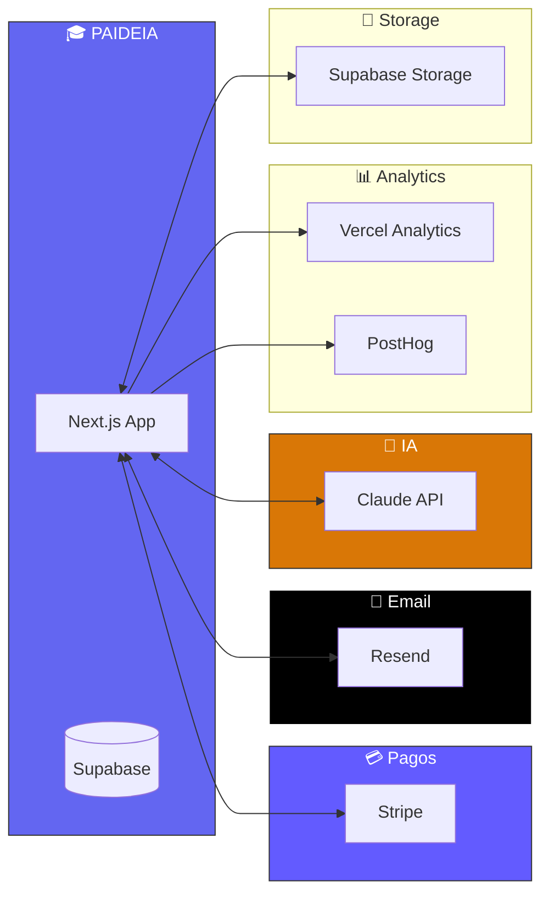

# ⚡ AUTOMATIZACIONES - PAIDEIA Platform

## Sistema de Automatizaciones y Eventos

**Versión**: 1.0
**Fecha**: 29 de Noviembre 2025
**Stack**: Next.js + Supabase + Vercel

---

## 📌 ÍNDICE

1. [Mapa de Automatizaciones](#1-mapa-de-automatizaciones)
2. [Triggers de Base de Datos](#2-triggers-de-base-de-datos)
3. [Webhooks y Eventos](#3-webhooks-y-eventos)
4. [Sistema de Notificaciones](#4-sistema-de-notificaciones)
5. [Emails Transaccionales](#5-emails-transaccionales)
6. [Cron Jobs / Tareas Programadas](#6-cron-jobs--tareas-programadas)
7. [Realtime Updates](#7-realtime-updates)
8. [Gamificación Automática](#8-gamificación-automática)
9. [Integraciones Externas](#9-integraciones-externas)
10. [Código de Implementación](#10-código-de-implementación)

---

## 1. MAPA DE AUTOMATIZACIONES

### Diagrama General



### Lista Completa de Automatizaciones

| # | Evento | Acción Automática | Prioridad |
|---|--------|-------------------|-----------|
| 1 | Usuario se registra | Crear perfil + Email bienvenida | 🔴 Alta |
| 2 | Completa quiz perfil | Asignar ruta personalizada | 🔴 Alta |
| 3 | Completa módulo | Actualizar progreso + Badge | 🔴 Alta |
| 4 | Aprueba quiz de nivel | Desbloquear siguiente nivel | 🔴 Alta |
| 5 | Completa nivel | Generar certificado + Email | 🔴 Alta |
| 6 | 3 días inactivo | Email recordatorio | 🟡 Media |
| 7 | 7 días inactivo | Email "te extrañamos" | 🟡 Media |
| 8 | Primer módulo completado | Badge "Primer Paso" | 🟢 Baja |
| 9 | 5 módulos en un día | Badge "Imparable" | 🟢 Baja |
| 10 | Pago exitoso | Activar Premium + Email | 🔴 Alta |
| 11 | Pago fallido | Email de recuperación | 🔴 Alta |
| 12 | Suscripción por vencer | Email recordatorio (3 días) | 🟡 Media |
| 13 | Certificado Master | Email especial + LinkedIn share | 🟡 Media |

---

## 2. TRIGGERS DE BASE DE DATOS

### 2.1 Auto-crear Perfil al Registrarse

```sql
-- ═══════════════════════════════════════════════════════════════
-- TRIGGER: Crear perfil automáticamente cuando usuario se registra
-- ═══════════════════════════════════════════════════════════════

CREATE OR REPLACE FUNCTION public.handle_new_user()
RETURNS TRIGGER AS $$
BEGIN
    -- Crear perfil con datos iniciales
    INSERT INTO public.perfiles (
        auth_id,
        email,
        nombre,
        nivel_actual,
        plan,
        fecha_registro
    ) VALUES (
        NEW.id,
        NEW.email,
        COALESCE(NEW.raw_user_meta_data->>'nombre', NEW.raw_user_meta_data->>'full_name', 'Estudiante'),
        0,  -- Empieza en nivel 0
        'gratuito',
        NOW()
    );

    -- Registrar evento para analytics
    INSERT INTO public.eventos_analytics (
        user_id,
        evento,
        metadata
    ) VALUES (
        NEW.id,
        'usuario_registrado',
        jsonb_build_object(
            'fuente', COALESCE(NEW.raw_user_meta_data->>'signup_source', 'directo'),
            'provider', NEW.raw_app_meta_data->>'provider'
        )
    );

    RETURN NEW;
END;
$$ LANGUAGE plpgsql SECURITY DEFINER;

-- Crear trigger
DROP TRIGGER IF EXISTS on_auth_user_created ON auth.users;
CREATE TRIGGER on_auth_user_created
    AFTER INSERT ON auth.users
    FOR EACH ROW
    EXECUTE FUNCTION public.handle_new_user();
```

### 2.2 Auto-actualizar Nivel al Completar Módulos

```sql
-- ═══════════════════════════════════════════════════════════════
-- TRIGGER: Actualizar nivel del usuario cuando completa módulos
-- ═══════════════════════════════════════════════════════════════

CREATE OR REPLACE FUNCTION public.check_level_completion()
RETURNS TRIGGER AS $$
DECLARE
    v_user_id UUID;
    v_nivel_actual INTEGER;
    v_modulos_nivel INTEGER;
    v_modulos_completados INTEGER;
    v_nuevo_nivel INTEGER;
BEGIN
    -- Solo ejecutar si el módulo se marcó como completado
    IF NEW.completado = TRUE AND (OLD.completado IS NULL OR OLD.completado = FALSE) THEN

        v_user_id := NEW.user_id;

        -- Obtener nivel actual del usuario
        SELECT nivel_actual INTO v_nivel_actual
        FROM perfiles
        WHERE id = v_user_id;

        -- Contar módulos requeridos para el nivel actual
        SELECT COUNT(*) INTO v_modulos_nivel
        FROM modulos
        WHERE nivel_id = v_nivel_actual;

        -- Contar módulos completados en el nivel actual
        SELECT COUNT(*) INTO v_modulos_completados
        FROM progreso p
        JOIN modulos m ON p.modulo_id = m.id
        WHERE p.user_id = v_user_id
        AND m.nivel_id = v_nivel_actual
        AND p.completado = TRUE;

        -- Si completó todos los módulos del nivel
        IF v_modulos_completados >= v_modulos_nivel THEN
            v_nuevo_nivel := v_nivel_actual + 1;

            -- Actualizar nivel del usuario
            UPDATE perfiles
            SET nivel_actual = v_nuevo_nivel,
                ultima_actividad = NOW()
            WHERE id = v_user_id;

            -- Registrar evento de nivel completado
            INSERT INTO eventos_nivel (
                user_id,
                nivel_completado,
                fecha
            ) VALUES (
                v_user_id,
                v_nivel_actual,
                NOW()
            );

            -- Insertar notificación
            INSERT INTO notificaciones (
                user_id,
                tipo,
                titulo,
                mensaje,
                accion_url
            ) VALUES (
                v_user_id,
                'nivel_completado',
                '🎉 ¡Nivel Completado!',
                'Has completado el Nivel ' || v_nivel_actual || '. ¡El Nivel ' || v_nuevo_nivel || ' está desbloqueado!',
                '/nivel/' || v_nuevo_nivel
            );
        END IF;
    END IF;

    RETURN NEW;
END;
$$ LANGUAGE plpgsql SECURITY DEFINER;

-- Crear trigger
DROP TRIGGER IF EXISTS on_progreso_updated ON progreso;
CREATE TRIGGER on_progreso_updated
    AFTER UPDATE ON progreso
    FOR EACH ROW
    EXECUTE FUNCTION public.check_level_completion();
```

### 2.3 Auto-generar Código de Certificado

```sql
-- ═══════════════════════════════════════════════════════════════
-- TRIGGER: Generar código único al crear certificado
-- ═══════════════════════════════════════════════════════════════

CREATE OR REPLACE FUNCTION public.generate_certificate_code()
RETURNS TRIGGER AS $$
DECLARE
    v_codigo TEXT;
    v_existe BOOLEAN;
BEGIN
    -- Generar código único
    LOOP
        v_codigo := 'PAIDEIA-' ||
                    UPPER(SUBSTRING(MD5(RANDOM()::TEXT || CLOCK_TIMESTAMP()::TEXT) FROM 1 FOR 4)) || '-' ||
                    UPPER(SUBSTRING(MD5(RANDOM()::TEXT || CLOCK_TIMESTAMP()::TEXT) FROM 5 FOR 4)) || '-' ||
                    UPPER(SUBSTRING(MD5(RANDOM()::TEXT || CLOCK_TIMESTAMP()::TEXT) FROM 9 FOR 4));

        -- Verificar que no existe
        SELECT EXISTS(
            SELECT 1 FROM certificados WHERE codigo_verificacion = v_codigo
        ) INTO v_existe;

        EXIT WHEN NOT v_existe;
    END LOOP;

    NEW.codigo_verificacion := v_codigo;
    NEW.fecha_emision := NOW();

    RETURN NEW;
END;
$$ LANGUAGE plpgsql;

-- Crear trigger
DROP TRIGGER IF EXISTS before_certificate_insert ON certificados;
CREATE TRIGGER before_certificate_insert
    BEFORE INSERT ON certificados
    FOR EACH ROW
    EXECUTE FUNCTION public.generate_certificate_code();
```

### 2.4 Auto-otorgar Badges (Gamificación)

```sql
-- ═══════════════════════════════════════════════════════════════
-- TRIGGER: Otorgar badges automáticamente
-- ═══════════════════════════════════════════════════════════════

CREATE OR REPLACE FUNCTION public.check_badges()
RETURNS TRIGGER AS $$
DECLARE
    v_user_id UUID;
    v_total_modulos INTEGER;
    v_modulos_hoy INTEGER;
    v_dias_consecutivos INTEGER;
BEGIN
    v_user_id := NEW.user_id;

    -- Contar total de módulos completados
    SELECT COUNT(*) INTO v_total_modulos
    FROM progreso
    WHERE user_id = v_user_id AND completado = TRUE;

    -- Badge: Primer Paso (1 módulo)
    IF v_total_modulos = 1 THEN
        INSERT INTO badges_usuario (user_id, badge_id)
        VALUES (v_user_id, 'primer_paso')
        ON CONFLICT DO NOTHING;
    END IF;

    -- Badge: En Racha (5 módulos)
    IF v_total_modulos = 5 THEN
        INSERT INTO badges_usuario (user_id, badge_id)
        VALUES (v_user_id, 'en_racha')
        ON CONFLICT DO NOTHING;
    END IF;

    -- Badge: Imparable (10 módulos)
    IF v_total_modulos = 10 THEN
        INSERT INTO badges_usuario (user_id, badge_id)
        VALUES (v_user_id, 'imparable')
        ON CONFLICT DO NOTHING;
    END IF;

    -- Badge: Maratonista (5+ módulos en un día)
    SELECT COUNT(*) INTO v_modulos_hoy
    FROM progreso
    WHERE user_id = v_user_id
    AND completado = TRUE
    AND fecha_completado::DATE = CURRENT_DATE;

    IF v_modulos_hoy >= 5 THEN
        INSERT INTO badges_usuario (user_id, badge_id)
        VALUES (v_user_id, 'maratonista')
        ON CONFLICT DO NOTHING;
    END IF;

    RETURN NEW;
END;
$$ LANGUAGE plpgsql SECURITY DEFINER;

-- Crear trigger
DROP TRIGGER IF EXISTS on_modulo_completed ON progreso;
CREATE TRIGGER on_modulo_completed
    AFTER UPDATE OF completado ON progreso
    FOR EACH ROW
    WHEN (NEW.completado = TRUE)
    EXECUTE FUNCTION public.check_badges();
```

---

## 3. WEBHOOKS Y EVENTOS

### 3.1 Webhook de Stripe (Pagos)

```typescript
// app/api/webhooks/stripe/route.ts

import { NextRequest, NextResponse } from 'next/server'
import { headers } from 'next/headers'
import Stripe from 'stripe'
import { createServerSupabase } from '@/lib/supabase/server'

const stripe = new Stripe(process.env.STRIPE_SECRET_KEY!)
const webhookSecret = process.env.STRIPE_WEBHOOK_SECRET!

export async function POST(request: NextRequest) {
  const body = await request.text()
  const signature = headers().get('stripe-signature')!

  let event: Stripe.Event

  try {
    event = stripe.webhooks.constructEvent(body, signature, webhookSecret)
  } catch (err: any) {
    console.error('Webhook signature verification failed:', err.message)
    return NextResponse.json({ error: 'Invalid signature' }, { status: 400 })
  }

  const supabase = createServerSupabase()

  switch (event.type) {
    // ═══════════════════════════════════════════════════════════
    // PAGO EXITOSO - Activar Premium
    // ═══════════════════════════════════════════════════════════
    case 'checkout.session.completed': {
      const session = event.data.object as Stripe.Checkout.Session
      const userId = session.metadata?.user_id

      if (userId) {
        // Actualizar plan a Premium
        await supabase
          .from('perfiles')
          .update({ plan: 'premium' })
          .eq('auth_id', userId)

        // Crear registro de suscripción
        await supabase.from('suscripciones').insert({
          user_id: userId,
          plan: 'premium',
          estado: 'activo',
          stripe_customer_id: session.customer as string,
          stripe_subscription_id: session.subscription as string,
        })

        // Registrar evento
        await supabase.from('eventos_analytics').insert({
          user_id: userId,
          evento: 'pago_completado',
          metadata: {
            amount: session.amount_total,
            currency: session.currency,
          },
        })

        // Disparar email de bienvenida Premium
        await fetch(`${process.env.NEXT_PUBLIC_APP_URL}/api/emails/premium-welcome`, {
          method: 'POST',
          headers: { 'Content-Type': 'application/json' },
          body: JSON.stringify({ userId }),
        })
      }
      break
    }

    // ═══════════════════════════════════════════════════════════
    // PAGO FALLIDO
    // ═══════════════════════════════════════════════════════════
    case 'invoice.payment_failed': {
      const invoice = event.data.object as Stripe.Invoice
      const customerId = invoice.customer as string

      // Buscar usuario por customer_id
      const { data: suscripcion } = await supabase
        .from('suscripciones')
        .select('user_id')
        .eq('stripe_customer_id', customerId)
        .single()

      if (suscripcion) {
        // Enviar email de pago fallido
        await fetch(`${process.env.NEXT_PUBLIC_APP_URL}/api/emails/payment-failed`, {
          method: 'POST',
          headers: { 'Content-Type': 'application/json' },
          body: JSON.stringify({ userId: suscripcion.user_id }),
        })
      }
      break
    }

    // ═══════════════════════════════════════════════════════════
    // SUSCRIPCIÓN CANCELADA
    // ═══════════════════════════════════════════════════════════
    case 'customer.subscription.deleted': {
      const subscription = event.data.object as Stripe.Subscription

      // Actualizar estado
      await supabase
        .from('suscripciones')
        .update({ estado: 'cancelado', fecha_fin: new Date().toISOString() })
        .eq('stripe_subscription_id', subscription.id)

      // Degradar a plan gratuito
      const { data: suscripcion } = await supabase
        .from('suscripciones')
        .select('user_id')
        .eq('stripe_subscription_id', subscription.id)
        .single()

      if (suscripcion) {
        await supabase
          .from('perfiles')
          .update({ plan: 'gratuito' })
          .eq('id', suscripcion.user_id)
      }
      break
    }
  }

  return NextResponse.json({ received: true })
}
```

### 3.2 Webhook de Autenticación (Supabase)

```typescript
// app/api/webhooks/auth/route.ts

import { NextRequest, NextResponse } from 'next/server'
import { createServerSupabase } from '@/lib/supabase/server'

export async function POST(request: NextRequest) {
  const payload = await request.json()
  const { type, record, old_record } = payload

  const supabase = createServerSupabase()

  switch (type) {
    // ═══════════════════════════════════════════════════════════
    // USUARIO CONFIRMÓ EMAIL
    // ═══════════════════════════════════════════════════════════
    case 'UPDATE':
      if (record.email_confirmed_at && !old_record.email_confirmed_at) {
        // Enviar email de bienvenida
        await fetch(`${process.env.NEXT_PUBLIC_APP_URL}/api/emails/welcome`, {
          method: 'POST',
          headers: { 'Content-Type': 'application/json' },
          body: JSON.stringify({
            email: record.email,
            nombre: record.raw_user_meta_data?.nombre || 'Estudiante',
          }),
        })

        // Crear notificación in-app
        const { data: perfil } = await supabase
          .from('perfiles')
          .select('id')
          .eq('auth_id', record.id)
          .single()

        if (perfil) {
          await supabase.from('notificaciones').insert({
            user_id: perfil.id,
            tipo: 'bienvenida',
            titulo: '¡Bienvenido a PAIDEIA!',
            mensaje: 'Tu cuenta está lista. Comienza con el quiz de perfil para personalizar tu experiencia.',
            accion_url: '/quiz-perfil',
          })
        }
      }
      break
  }

  return NextResponse.json({ success: true })
}
```

---

## 4. SISTEMA DE NOTIFICACIONES

### 4.1 Tabla de Notificaciones

```sql
-- ═══════════════════════════════════════════════════════════════
-- TABLA: notificaciones
-- ═══════════════════════════════════════════════════════════════

CREATE TABLE notificaciones (
    id UUID PRIMARY KEY DEFAULT uuid_generate_v4(),
    user_id UUID REFERENCES perfiles(id) ON DELETE CASCADE,
    tipo TEXT NOT NULL,
    titulo TEXT NOT NULL,
    mensaje TEXT NOT NULL,
    accion_url TEXT,
    leida BOOLEAN DEFAULT FALSE,
    fecha TIMESTAMPTZ DEFAULT NOW(),
    metadata JSONB DEFAULT '{}'
);

-- Tipos de notificación:
-- 'bienvenida', 'nivel_completado', 'badge_obtenido',
-- 'certificado_listo', 'recordatorio', 'sistema'

CREATE INDEX idx_notif_user ON notificaciones(user_id);
CREATE INDEX idx_notif_leida ON notificaciones(leida);
```

### 4.2 API de Notificaciones

```typescript
// app/api/notificaciones/route.ts

import { NextRequest, NextResponse } from 'next/server'
import { createServerSupabase } from '@/lib/supabase/server'

// GET - Obtener notificaciones del usuario
export async function GET(request: NextRequest) {
  const supabase = createServerSupabase()

  const { data: { user } } = await supabase.auth.getUser()
  if (!user) {
    return NextResponse.json({ error: 'No autorizado' }, { status: 401 })
  }

  const { data: perfil } = await supabase
    .from('perfiles')
    .select('id')
    .eq('auth_id', user.id)
    .single()

  const { data: notificaciones } = await supabase
    .from('notificaciones')
    .select('*')
    .eq('user_id', perfil?.id)
    .order('fecha', { ascending: false })
    .limit(50)

  const noLeidas = notificaciones?.filter(n => !n.leida).length || 0

  return NextResponse.json({ notificaciones, noLeidas })
}

// PATCH - Marcar como leída
export async function PATCH(request: NextRequest) {
  const supabase = createServerSupabase()
  const { id } = await request.json()

  await supabase
    .from('notificaciones')
    .update({ leida: true })
    .eq('id', id)

  return NextResponse.json({ success: true })
}

// POST - Marcar todas como leídas
export async function POST(request: NextRequest) {
  const supabase = createServerSupabase()

  const { data: { user } } = await supabase.auth.getUser()
  if (!user) {
    return NextResponse.json({ error: 'No autorizado' }, { status: 401 })
  }

  const { data: perfil } = await supabase
    .from('perfiles')
    .select('id')
    .eq('auth_id', user.id)
    .single()

  await supabase
    .from('notificaciones')
    .update({ leida: true })
    .eq('user_id', perfil?.id)
    .eq('leida', false)

  return NextResponse.json({ success: true })
}
```

### 4.3 Hook de Notificaciones con Realtime

```typescript
// hooks/useNotificaciones.ts

import { useEffect, useState } from 'react'
import { createClient } from '@/lib/supabase/client'

interface Notificacion {
  id: string
  tipo: string
  titulo: string
  mensaje: string
  accion_url?: string
  leida: boolean
  fecha: string
}

export function useNotificaciones() {
  const [notificaciones, setNotificaciones] = useState<Notificacion[]>([])
  const [noLeidas, setNoLeidas] = useState(0)
  const supabase = createClient()

  useEffect(() => {
    // Cargar notificaciones iniciales
    fetchNotificaciones()

    // Suscribirse a nuevas notificaciones en tiempo real
    const channel = supabase
      .channel('notificaciones')
      .on(
        'postgres_changes',
        {
          event: 'INSERT',
          schema: 'public',
          table: 'notificaciones',
        },
        (payload) => {
          const nuevaNotif = payload.new as Notificacion
          setNotificaciones(prev => [nuevaNotif, ...prev])
          setNoLeidas(prev => prev + 1)

          // Mostrar notificación del navegador
          if (Notification.permission === 'granted') {
            new Notification(nuevaNotif.titulo, {
              body: nuevaNotif.mensaje,
              icon: '/icon.png',
            })
          }
        }
      )
      .subscribe()

    return () => {
      supabase.removeChannel(channel)
    }
  }, [])

  const fetchNotificaciones = async () => {
    const response = await fetch('/api/notificaciones')
    const data = await response.json()
    setNotificaciones(data.notificaciones || [])
    setNoLeidas(data.noLeidas || 0)
  }

  const marcarLeida = async (id: string) => {
    await fetch('/api/notificaciones', {
      method: 'PATCH',
      headers: { 'Content-Type': 'application/json' },
      body: JSON.stringify({ id }),
    })
    setNotificaciones(prev =>
      prev.map(n => (n.id === id ? { ...n, leida: true } : n))
    )
    setNoLeidas(prev => Math.max(0, prev - 1))
  }

  const marcarTodasLeidas = async () => {
    await fetch('/api/notificaciones', { method: 'POST' })
    setNotificaciones(prev => prev.map(n => ({ ...n, leida: true })))
    setNoLeidas(0)
  }

  return { notificaciones, noLeidas, marcarLeida, marcarTodasLeidas }
}
```

---

## 5. EMAILS TRANSACCIONALES

### 5.1 Configuración con Resend

```typescript
// lib/email/resend.ts

import { Resend } from 'resend'

export const resend = new Resend(process.env.RESEND_API_KEY)

export const EMAIL_FROM = 'PAIDEIA <noreply@paideia.com>'
```

### 5.2 Templates de Email

```typescript
// lib/email/templates.ts

export const templates = {
  // ═══════════════════════════════════════════════════════════
  // EMAIL DE BIENVENIDA
  // ═══════════════════════════════════════════════════════════
  welcome: (nombre: string) => ({
    subject: '¡Bienvenido a PAIDEIA! 🎓',
    html: `
      <!DOCTYPE html>
      <html>
      <head>
        <meta charset="utf-8">
        <style>
          body { font-family: 'Segoe UI', Arial, sans-serif; line-height: 1.6; color: #333; }
          .container { max-width: 600px; margin: 0 auto; padding: 20px; }
          .header { background: linear-gradient(135deg, #6366F1, #8B5CF6); padding: 30px; text-align: center; border-radius: 10px 10px 0 0; }
          .header h1 { color: white; margin: 0; }
          .content { background: #f9fafb; padding: 30px; border-radius: 0 0 10px 10px; }
          .button { display: inline-block; background: #6366F1; color: white; padding: 12px 30px; text-decoration: none; border-radius: 8px; margin: 20px 0; }
          .footer { text-align: center; padding: 20px; color: #666; font-size: 12px; }
        </style>
      </head>
      <body>
        <div class="container">
          <div class="header">
            <h1>🎓 PAIDEIA</h1>
            <p style="color: rgba(255,255,255,0.9); margin: 10px 0 0 0;">PMO Virtual con IA</p>
          </div>
          <div class="content">
            <h2>¡Hola ${nombre}! 👋</h2>
            <p>Bienvenido a PAIDEIA, tu plataforma de formación en gestión de proyectos con Inteligencia Artificial.</p>

            <p><strong>Tu próximo paso:</strong></p>
            <p>Completa el quiz de perfil para personalizar tu ruta de aprendizaje según tu área profesional.</p>

            <center>
              <a href="${process.env.NEXT_PUBLIC_APP_URL}/quiz-perfil" class="button">
                Comenzar Quiz de Perfil →
              </a>
            </center>

            <p>El quiz toma solo 2 minutos y te asignará una ruta personalizada.</p>

            <p>¡Nos vemos dentro!</p>
            <p><strong>El equipo de PAIDEIA</strong></p>
          </div>
          <div class="footer">
            <p>© 2025 PAIDEIA - PMO Virtual</p>
            <p>Si no creaste esta cuenta, puedes ignorar este email.</p>
          </div>
        </div>
      </body>
      </html>
    `,
  }),

  // ═══════════════════════════════════════════════════════════
  // NIVEL COMPLETADO
  // ═══════════════════════════════════════════════════════════
  nivelCompletado: (nombre: string, nivel: number) => ({
    subject: `🎉 ¡Felicidades! Completaste el Nivel ${nivel}`,
    html: `
      <!DOCTYPE html>
      <html>
      <head>
        <meta charset="utf-8">
        <style>
          body { font-family: 'Segoe UI', Arial, sans-serif; line-height: 1.6; color: #333; }
          .container { max-width: 600px; margin: 0 auto; padding: 20px; }
          .header { background: linear-gradient(135deg, #10B981, #059669); padding: 30px; text-align: center; border-radius: 10px 10px 0 0; }
          .header h1 { color: white; margin: 0; font-size: 48px; }
          .content { background: #f9fafb; padding: 30px; border-radius: 0 0 10px 10px; }
          .button { display: inline-block; background: #10B981; color: white; padding: 12px 30px; text-decoration: none; border-radius: 8px; margin: 20px 0; }
          .stats { background: white; padding: 20px; border-radius: 8px; margin: 20px 0; }
        </style>
      </head>
      <body>
        <div class="container">
          <div class="header">
            <h1>🎉</h1>
            <h2 style="color: white; margin: 10px 0 0 0;">¡Nivel ${nivel} Completado!</h2>
          </div>
          <div class="content">
            <h2>¡Increíble trabajo, ${nombre}! 🌟</h2>

            <p>Has demostrado dominio de todos los conceptos del <strong>Nivel ${nivel}</strong>.</p>

            <div class="stats">
              <p><strong>Tu progreso:</strong></p>
              <p>✅ Nivel ${nivel} - Completado</p>
              <p>🔓 Nivel ${nivel + 1} - Desbloqueado</p>
            </div>

            <p>Tu certificado de nivel está listo para descargar desde tu perfil.</p>

            <center>
              <a href="${process.env.NEXT_PUBLIC_APP_URL}/nivel/${nivel + 1}" class="button">
                Continuar al Nivel ${nivel + 1} →
              </a>
            </center>

            <p>¡Sigue así! Cada nivel te acerca más a convertirte en un experto en PMO con IA.</p>
          </div>
        </div>
      </body>
      </html>
    `,
  }),

  // ═══════════════════════════════════════════════════════════
  // RECORDATORIO DE INACTIVIDAD (3 días)
  // ═══════════════════════════════════════════════════════════
  recordatorio3Dias: (nombre: string, ultimoModulo: string) => ({
    subject: '¿Todo bien? Te extrañamos en PAIDEIA 👀',
    html: `
      <!DOCTYPE html>
      <html>
      <head>
        <meta charset="utf-8">
        <style>
          body { font-family: 'Segoe UI', Arial, sans-serif; line-height: 1.6; color: #333; }
          .container { max-width: 600px; margin: 0 auto; padding: 20px; }
          .header { background: linear-gradient(135deg, #F59E0B, #D97706); padding: 30px; text-align: center; border-radius: 10px 10px 0 0; }
          .content { background: #f9fafb; padding: 30px; border-radius: 0 0 10px 10px; }
          .button { display: inline-block; background: #F59E0B; color: white; padding: 12px 30px; text-decoration: none; border-radius: 8px; margin: 20px 0; }
        </style>
      </head>
      <body>
        <div class="container">
          <div class="header">
            <h1 style="color: white; margin: 0;">👋 ¿Sigues ahí?</h1>
          </div>
          <div class="content">
            <h2>Hola ${nombre},</h2>

            <p>Notamos que no has vuelto a PAIDEIA en unos días.</p>

            <p>Tu último módulo fue: <strong>${ultimoModulo}</strong></p>

            <p>Sabemos que la vida puede ser ocupada, pero recuerda:</p>
            <ul>
              <li>Solo 15-20 minutos al día hacen la diferencia</li>
              <li>Tu progreso te está esperando</li>
              <li>Cada módulo te acerca a tu certificación</li>
            </ul>

            <center>
              <a href="${process.env.NEXT_PUBLIC_APP_URL}/dashboard" class="button">
                Retomar mi aprendizaje →
              </a>
            </center>

            <p>¡Te esperamos!</p>
          </div>
        </div>
      </body>
      </html>
    `,
  }),

  // ═══════════════════════════════════════════════════════════
  // BIENVENIDA PREMIUM
  // ═══════════════════════════════════════════════════════════
  premiumWelcome: (nombre: string) => ({
    subject: '🚀 ¡Bienvenido a PAIDEIA Premium!',
    html: `
      <!DOCTYPE html>
      <html>
      <head>
        <meta charset="utf-8">
        <style>
          body { font-family: 'Segoe UI', Arial, sans-serif; line-height: 1.6; color: #333; }
          .container { max-width: 600px; margin: 0 auto; padding: 20px; }
          .header { background: linear-gradient(135deg, #8B5CF6, #6366F1); padding: 30px; text-align: center; border-radius: 10px 10px 0 0; }
          .content { background: #f9fafb; padding: 30px; border-radius: 0 0 10px 10px; }
          .button { display: inline-block; background: #8B5CF6; color: white; padding: 12px 30px; text-decoration: none; border-radius: 8px; margin: 20px 0; }
          .feature { background: white; padding: 15px; border-radius: 8px; margin: 10px 0; border-left: 4px solid #8B5CF6; }
        </style>
      </head>
      <body>
        <div class="container">
          <div class="header">
            <h1 style="color: white; margin: 0;">⭐ PREMIUM</h1>
            <p style="color: rgba(255,255,255,0.9);">¡Gracias por tu confianza!</p>
          </div>
          <div class="content">
            <h2>¡Hola ${nombre}! 🎉</h2>

            <p>Tu cuenta Premium está activa. Ahora tienes acceso a:</p>

            <div class="feature">
              <strong>🤖 IA Asistente Personal</strong>
              <p style="margin: 5px 0 0 0;">Tu tutor de IA disponible 24/7 para resolver dudas.</p>
            </div>

            <div class="feature">
              <strong>📜 Certificados Verificables</strong>
              <p style="margin: 5px 0 0 0;">Certificados con código único para compartir en LinkedIn.</p>
            </div>

            <div class="feature">
              <strong>🎯 Contenido Exclusivo</strong>
              <p style="margin: 5px 0 0 0;">Módulos avanzados y especializaciones por perfil.</p>
            </div>

            <div class="feature">
              <strong>💬 Soporte Prioritario</strong>
              <p style="margin: 5px 0 0 0;">Respuesta en menos de 24 horas.</p>
            </div>

            <center>
              <a href="${process.env.NEXT_PUBLIC_APP_URL}/asistente" class="button">
                Probar IA Asistente →
              </a>
            </center>
          </div>
        </div>
      </body>
      </html>
    `,
  }),
}
```

### 5.3 API Routes de Emails

```typescript
// app/api/emails/welcome/route.ts

import { NextRequest, NextResponse } from 'next/server'
import { resend, EMAIL_FROM } from '@/lib/email/resend'
import { templates } from '@/lib/email/templates'

export async function POST(request: NextRequest) {
  try {
    const { email, nombre } = await request.json()

    const template = templates.welcome(nombre)

    await resend.emails.send({
      from: EMAIL_FROM,
      to: email,
      subject: template.subject,
      html: template.html,
    })

    return NextResponse.json({ success: true })
  } catch (error) {
    console.error('Error enviando email:', error)
    return NextResponse.json({ error: 'Error enviando email' }, { status: 500 })
  }
}
```

---

## 6. CRON JOBS / TAREAS PROGRAMADAS

### 6.1 Configuración con Vercel Cron

```json
// vercel.json
{
  "crons": [
    {
      "path": "/api/cron/recordatorios",
      "schedule": "0 9 * * *"
    },
    {
      "path": "/api/cron/limpieza",
      "schedule": "0 3 * * 0"
    },
    {
      "path": "/api/cron/suscripciones",
      "schedule": "0 8 * * *"
    }
  ]
}
```

### 6.2 Cron: Recordatorios de Inactividad

```typescript
// app/api/cron/recordatorios/route.ts

import { NextRequest, NextResponse } from 'next/server'
import { createClient } from '@supabase/supabase-js'
import { resend, EMAIL_FROM } from '@/lib/email/resend'
import { templates } from '@/lib/email/templates'

// Usar service role para acceso admin
const supabase = createClient(
  process.env.NEXT_PUBLIC_SUPABASE_URL!,
  process.env.SUPABASE_SERVICE_ROLE_KEY!
)

export async function GET(request: NextRequest) {
  // Verificar que es una llamada de Vercel Cron
  const authHeader = request.headers.get('authorization')
  if (authHeader !== `Bearer ${process.env.CRON_SECRET}`) {
    return NextResponse.json({ error: 'Unauthorized' }, { status: 401 })
  }

  try {
    // ═══════════════════════════════════════════════════════════
    // USUARIOS INACTIVOS 3 DÍAS
    // ═══════════════════════════════════════════════════════════
    const hace3Dias = new Date()
    hace3Dias.setDate(hace3Dias.getDate() - 3)

    const { data: inactivos3Dias } = await supabase
      .from('perfiles')
      .select('id, email, nombre, ultima_actividad')
      .lt('ultima_actividad', hace3Dias.toISOString())
      .gt('ultima_actividad', new Date(hace3Dias.getTime() - 24 * 60 * 60 * 1000).toISOString())

    for (const usuario of inactivos3Dias || []) {
      // Obtener último módulo
      const { data: ultimoProgreso } = await supabase
        .from('progreso')
        .select('modulo_id')
        .eq('user_id', usuario.id)
        .order('fecha_completado', { ascending: false })
        .limit(1)
        .single()

      const template = templates.recordatorio3Dias(
        usuario.nombre || 'Estudiante',
        ultimoProgreso?.modulo_id || 'Inicio'
      )

      await resend.emails.send({
        from: EMAIL_FROM,
        to: usuario.email,
        subject: template.subject,
        html: template.html,
      })

      // Registrar que se envió el recordatorio
      await supabase.from('emails_enviados').insert({
        user_id: usuario.id,
        tipo: 'recordatorio_3_dias',
        fecha: new Date().toISOString(),
      })
    }

    // ═══════════════════════════════════════════════════════════
    // USUARIOS INACTIVOS 7 DÍAS
    // ═══════════════════════════════════════════════════════════
    const hace7Dias = new Date()
    hace7Dias.setDate(hace7Dias.getDate() - 7)

    const { data: inactivos7Dias } = await supabase
      .from('perfiles')
      .select('id, email, nombre')
      .lt('ultima_actividad', hace7Dias.toISOString())
      .gt('ultima_actividad', new Date(hace7Dias.getTime() - 24 * 60 * 60 * 1000).toISOString())

    // ... similar lógica para email de 7 días

    return NextResponse.json({
      success: true,
      recordatorios_3_dias: inactivos3Dias?.length || 0,
      recordatorios_7_dias: inactivos7Dias?.length || 0,
    })

  } catch (error) {
    console.error('Error en cron de recordatorios:', error)
    return NextResponse.json({ error: 'Error interno' }, { status: 500 })
  }
}
```

### 6.3 Cron: Verificar Suscripciones por Vencer

```typescript
// app/api/cron/suscripciones/route.ts

import { NextRequest, NextResponse } from 'next/server'
import { createClient } from '@supabase/supabase-js'
import { resend, EMAIL_FROM } from '@/lib/email/resend'

const supabase = createClient(
  process.env.NEXT_PUBLIC_SUPABASE_URL!,
  process.env.SUPABASE_SERVICE_ROLE_KEY!
)

export async function GET(request: NextRequest) {
  const authHeader = request.headers.get('authorization')
  if (authHeader !== `Bearer ${process.env.CRON_SECRET}`) {
    return NextResponse.json({ error: 'Unauthorized' }, { status: 401 })
  }

  try {
    // Suscripciones que vencen en 3 días
    const en3Dias = new Date()
    en3Dias.setDate(en3Dias.getDate() + 3)

    const { data: porVencer } = await supabase
      .from('suscripciones')
      .select(`
        id,
        fecha_fin,
        perfiles!inner(email, nombre)
      `)
      .eq('estado', 'activo')
      .gte('fecha_fin', new Date().toISOString())
      .lte('fecha_fin', en3Dias.toISOString())

    for (const sub of porVencer || []) {
      await resend.emails.send({
        from: EMAIL_FROM,
        to: (sub.perfiles as any).email,
        subject: '⚠️ Tu suscripción Premium vence pronto',
        html: `
          <p>Hola ${(sub.perfiles as any).nombre},</p>
          <p>Tu suscripción Premium vence en 3 días.</p>
          <p>Renueva ahora para mantener acceso a:</p>
          <ul>
            <li>IA Asistente Personal</li>
            <li>Certificados verificables</li>
            <li>Contenido exclusivo</li>
          </ul>
          <a href="${process.env.NEXT_PUBLIC_APP_URL}/planes">Renovar ahora</a>
        `,
      })
    }

    return NextResponse.json({
      success: true,
      notificados: porVencer?.length || 0,
    })

  } catch (error) {
    console.error('Error en cron de suscripciones:', error)
    return NextResponse.json({ error: 'Error interno' }, { status: 500 })
  }
}
```

---

## 7. REALTIME UPDATES

### 7.1 Progreso en Tiempo Real

```typescript
// hooks/useProgresoRealtime.ts

import { useEffect, useState } from 'react'
import { createClient } from '@/lib/supabase/client'

export function useProgresoRealtime(userId: string) {
  const [progreso, setProgreso] = useState<any[]>([])
  const supabase = createClient()

  useEffect(() => {
    // Cargar progreso inicial
    const fetchProgreso = async () => {
      const { data } = await supabase
        .from('progreso')
        .select('*')
        .eq('user_id', userId)

      setProgreso(data || [])
    }

    fetchProgreso()

    // Suscribirse a cambios en tiempo real
    const channel = supabase
      .channel('progreso-changes')
      .on(
        'postgres_changes',
        {
          event: '*',
          schema: 'public',
          table: 'progreso',
          filter: `user_id=eq.${userId}`,
        },
        (payload) => {
          if (payload.eventType === 'INSERT') {
            setProgreso(prev => [...prev, payload.new])
          } else if (payload.eventType === 'UPDATE') {
            setProgreso(prev =>
              prev.map(p => (p.id === payload.new.id ? payload.new : p))
            )
          }
        }
      )
      .subscribe()

    return () => {
      supabase.removeChannel(channel)
    }
  }, [userId])

  return progreso
}
```

---

## 8. GAMIFICACIÓN AUTOMÁTICA

### 8.1 Sistema de Badges

```sql
-- ═══════════════════════════════════════════════════════════════
-- TABLA: badges (definición de badges)
-- ═══════════════════════════════════════════════════════════════

CREATE TABLE badges (
    id TEXT PRIMARY KEY,
    nombre TEXT NOT NULL,
    descripcion TEXT NOT NULL,
    icono TEXT NOT NULL,
    color TEXT NOT NULL,
    condicion TEXT NOT NULL,
    puntos INTEGER DEFAULT 10
);

-- Insertar badges
INSERT INTO badges (id, nombre, descripcion, icono, color, condicion, puntos) VALUES
('primer_paso', 'Primer Paso', 'Completaste tu primer módulo', '🚀', '#10B981', 'modulos_completados >= 1', 10),
('en_racha', 'En Racha', 'Completaste 5 módulos', '🔥', '#F59E0B', 'modulos_completados >= 5', 25),
('imparable', 'Imparable', 'Completaste 10 módulos', '⚡', '#8B5CF6', 'modulos_completados >= 10', 50),
('maratonista', 'Maratonista', '5+ módulos en un día', '🏃', '#EF4444', 'modulos_hoy >= 5', 30),
('madrugador', 'Madrugador', 'Estudiaste antes de las 7am', '🌅', '#F97316', 'hora_estudio < 7', 15),
('nocturno', 'Nocturno', 'Estudiaste después de las 11pm', '🌙', '#6366F1', 'hora_estudio > 23', 15),
('perfeccionista', 'Perfeccionista', '100% en un quiz', '💯', '#EC4899', 'quiz_score = 100', 40),
('consistente', 'Consistente', '7 días seguidos estudiando', '📅', '#14B8A6', 'dias_consecutivos >= 7', 50),
('graduado_n1', 'Graduado Nivel 1', 'Completaste el Nivel 1', '🎓', '#3B82F6', 'nivel >= 1', 100),
('graduado_n2', 'Graduado Nivel 2', 'Completaste el Nivel 2', '🎓', '#8B5CF6', 'nivel >= 2', 150),
('graduado_n3', 'Graduado Nivel 3', 'Completaste el Nivel 3', '🎓', '#EC4899', 'nivel >= 3', 200),
('master', 'Master PAIDEIA', 'Completaste todos los niveles', '👑', '#F59E0B', 'nivel >= 5', 500);

-- ═══════════════════════════════════════════════════════════════
-- TABLA: badges_usuario (badges obtenidos)
-- ═══════════════════════════════════════════════════════════════

CREATE TABLE badges_usuario (
    id UUID PRIMARY KEY DEFAULT uuid_generate_v4(),
    user_id UUID REFERENCES perfiles(id) ON DELETE CASCADE,
    badge_id TEXT REFERENCES badges(id),
    fecha_obtenido TIMESTAMPTZ DEFAULT NOW(),
    UNIQUE(user_id, badge_id)
);
```

### 8.2 Sistema de Puntos/XP

```sql
-- ═══════════════════════════════════════════════════════════════
-- TABLA: puntos_log (historial de puntos)
-- ═══════════════════════════════════════════════════════════════

CREATE TABLE puntos_log (
    id UUID PRIMARY KEY DEFAULT uuid_generate_v4(),
    user_id UUID REFERENCES perfiles(id) ON DELETE CASCADE,
    cantidad INTEGER NOT NULL,
    motivo TEXT NOT NULL,
    fecha TIMESTAMPTZ DEFAULT NOW()
);

-- ═══════════════════════════════════════════════════════════════
-- FUNCIÓN: Otorgar puntos
-- ═══════════════════════════════════════════════════════════════

CREATE OR REPLACE FUNCTION otorgar_puntos(
    p_user_id UUID,
    p_cantidad INTEGER,
    p_motivo TEXT
) RETURNS VOID AS $$
BEGIN
    -- Registrar en log
    INSERT INTO puntos_log (user_id, cantidad, motivo)
    VALUES (p_user_id, p_cantidad, p_motivo);

    -- Actualizar total en perfil
    UPDATE perfiles
    SET puntos_totales = COALESCE(puntos_totales, 0) + p_cantidad
    WHERE id = p_user_id;
END;
$$ LANGUAGE plpgsql SECURITY DEFINER;

-- Puntos por actividad:
-- Completar módulo: 10 puntos
-- Aprobar quiz: 20 puntos
-- Quiz perfecto (100%): 30 puntos bonus
-- Badge obtenido: Variable (10-500)
-- Completar nivel: 100 puntos
-- Racha de 7 días: 50 puntos bonus
```

---

## 9. INTEGRACIONES EXTERNAS

### 9.1 Resumen de Integraciones



### 9.2 Variables de Entorno Necesarias

```bash
# .env.local

# Supabase
NEXT_PUBLIC_SUPABASE_URL=https://xxx.supabase.co
NEXT_PUBLIC_SUPABASE_ANON_KEY=eyJhbGc...
SUPABASE_SERVICE_ROLE_KEY=eyJhbGc...

# Claude (Anthropic)
ANTHROPIC_API_KEY=sk-ant-api03-...

# Stripe
STRIPE_SECRET_KEY=sk_live_...
STRIPE_WEBHOOK_SECRET=whsec_...
NEXT_PUBLIC_STRIPE_PUBLISHABLE_KEY=pk_live_...

# Resend (Email)
RESEND_API_KEY=re_...

# Cron Jobs
CRON_SECRET=tu_secret_para_cron

# App
NEXT_PUBLIC_APP_URL=https://paideia.com
```

---

## 10. CÓDIGO DE IMPLEMENTACIÓN

### 10.1 Checklist de Implementación

```
AUTOMATIZACIONES - CHECKLIST DE IMPLEMENTACIÓN

TRIGGERS DE BASE DE DATOS
□ handle_new_user() - Auto-crear perfil
□ check_level_completion() - Auto-subir nivel
□ generate_certificate_code() - Código único
□ check_badges() - Otorgar badges

WEBHOOKS
□ /api/webhooks/stripe - Pagos
□ /api/webhooks/auth - Eventos de auth

NOTIFICACIONES
□ Tabla notificaciones
□ API /api/notificaciones
□ Hook useNotificaciones
□ Componente NotificationBell

EMAILS
□ Configurar Resend
□ Template: Bienvenida
□ Template: Nivel completado
□ Template: Recordatorio 3 días
□ Template: Recordatorio 7 días
□ Template: Premium welcome
□ Template: Pago fallido

CRON JOBS
□ /api/cron/recordatorios - Diario 9am
□ /api/cron/suscripciones - Diario 8am
□ /api/cron/limpieza - Semanal domingo 3am

REALTIME
□ Progreso en tiempo real
□ Notificaciones en tiempo real

GAMIFICACIÓN
□ Tabla badges
□ Tabla badges_usuario
□ Tabla puntos_log
□ Función otorgar_puntos
□ Trigger check_badges
```

---

**Documento creado**: 29 de Noviembre 2025
**Autor**: Claude (Asistente IA)
**Para**: PAIDEIA Platform
