# 🤖 AUTOMATIZACIONES DE DESARROLLO - PAIDEIA

## Sistema de Scripts, GitHub Actions y Memoria de Contexto

**Versión**: 1.0
**Fecha**: 29 de Noviembre 2025
**Propósito**: Automatizar flujo de trabajo y preservar contexto entre sesiones

---

## 📌 ÍNDICE

1. [Mapa de Automatizaciones](#1-mapa-de-automatizaciones)
2. [Scripts Python Existentes](#2-scripts-python-existentes)
3. [GitHub Actions](#3-github-actions)
4. [Sistema de Memoria/Contexto](#4-sistema-de-memoriacontexto)
5. [Scripts Nuevos Necesarios](#5-scripts-nuevos-necesarios)
6. [Git Hooks](#6-git-hooks)
7. [Comandos Útiles](#7-comandos-útiles)

---

## 1. MAPA DE AUTOMATIZACIONES


---

## 2. SCRIPTS PYTHON EXISTENTES

### 📍 Ubicación: `scripts/`

### 2.1 `update_indices.py`

**Propósito**: Escanea el repositorio y genera índice automático.

```
Entrada: Todo el repositorio
Salida:  INDICES/INDICE_MAESTRO_AUTO.md
```

**Qué hace:**
- Recorre todos los archivos del proyecto
- Cuenta líneas por archivo y extensión
- Genera árbol visual del proyecto
- Crea tabla de estadísticas
- Ignora: `.git`, `node_modules`, `__pycache__`

**Ejecutar manualmente:**
```bash
python scripts/update_indices.py
```

**Output ejemplo:**
```
📊 Estadísticas Automáticas
| Métrica | Valor |
|---------|-------|
| Archivos | 45 |
| Líneas de código | 12,345 |
| Directorios | 8 |
```

---

### 2.2 `update_current_state.py`

**Propósito**: Actualiza timestamps en CURRENT_STATE.md.

```
Entrada: 10000_CONTROL/CURRENT_STATE.md
Salida:  Mismo archivo con timestamp actualizado
```

**Qué hace:**
- Busca patrones de fecha (`**Última Actualización**: YYYY-MM-DD`)
- Reemplaza con fecha actual
- Mantiene el resto del contenido intacto

**Ejecutar manualmente:**
```bash
python scripts/update_current_state.py
```

---

### 2.3 `generate_progress.py`

**Propósito**: Genera reporte visual de progreso del proyecto.

```
Entrada: Repositorio + Git history
Salida:  10000_CONTROL/PROGRESS_REPORT_AUTO.md
```

**Qué hace:**
- Obtiene estadísticas de Git (commits totales, última semana)
- Cuenta archivos por tipo
- Calcula completado del SOUL CORE
- Genera barra de progreso visual
- Sugiere próximas acciones

**Ejecutar manualmente:**
```bash
python scripts/generate_progress.py
```

**Output ejemplo:**
```
🎯 PROGRESO SOUL CORE
████████████████░░░░ 80%
8/10 archivos críticos
```

---

## 3. GITHUB ACTIONS

### 3.1 `auto-docs.yml`

**Ubicación**: `.github/workflows/auto-docs.yml`

**Trigger**: Push a `main` (excepto archivos auto-generados)

```yaml
on:
  push:
    branches: [main]
    paths-ignore:
      - 'INDICES/INDICE_MAESTRO_AUTO.md'
      - '10000_CONTROL/PROGRESS_REPORT_AUTO.md'
  workflow_dispatch:  # Ejecución manual
```

**Flujo:**


**Ejecutar manualmente:**
1. Ir a GitHub → Actions → "🤖 Auto-Documentación PAIDEIA"
2. Click "Run workflow"
3. Seleccionar branch `main`
4. Click "Run workflow"

---

## 4. SISTEMA DE MEMORIA/CONTEXTO

### 4.1 Concepto

Para que Claude (yo) pueda "recordar" entre sesiones, necesitamos un sistema de contexto persistente.

```mermaid
flowchart LR
    subgraph Sesion1["📅 Sesión 1"]
        S1A[Trabajo realizado]
        S1B[Decisiones tomadas]
        S1C[Pendientes]
    end

    subgraph Memoria["💾 MEMORIA PERSISTENTE"]
        M1[SESSION_LOG.md]
        M2[CONTEXT_MEMORY.json]
        M3[CURRENT_STATE.md]
    end

    subgraph Sesion2["📅 Sesión 2"]
        S2A[Leer contexto]
        S2B[Continuar trabajo]
    end

    Sesion1 --> Memoria
    Memoria --> Sesion2

    style Memoria fill:#8B5CF6,stroke:#333,color:#fff
```



### 4.2 Archivos de Memoria

| Archivo | Propósito | Formato |
|---------|-----------|---------|
| `CURRENT_STATE.md` | Estado actual del proyecto | Markdown |
| `SESSION_LOG.md` | Historial de sesiones | Markdown |
| `CONTEXT_MEMORY.json` | Contexto estructurado para IA | JSON |
| `DECISIONS.md` | Decisiones importantes tomadas | Markdown |

---

## 5. SCRIPTS NUEVOS NECESARIOS

### 5.1 `save_session.py` - Guardar Contexto de Sesión

```python
#!/usr/bin/env python3
"""
PAIDEIA - Script para guardar contexto de sesión.
Guarda un resumen de lo trabajado para referencia futura.

Ejecutar: python scripts/save_session.py "Descripción de lo hecho"
"""

import sys
import json
import datetime
from pathlib import Path

ROOT_DIR = Path(__file__).parent.parent
SESSION_LOG = ROOT_DIR / "10000_CONTROL" / "SESSION_LOG.md"
CONTEXT_FILE = ROOT_DIR / "10000_CONTROL" / "CONTEXT_MEMORY.json"


def load_context() -> dict:
    """Carga contexto existente o crea uno nuevo."""
    if CONTEXT_FILE.exists():
        return json.loads(CONTEXT_FILE.read_text(encoding='utf-8'))
    return {
        "proyecto": "PAIDEIA",
        "sesiones": [],
        "decisiones_clave": [],
        "pendientes": [],
        "archivos_importantes": [],
        "stack_actual": "Next.js + Supabase + Vercel"
    }


def save_context(context: dict):
    """Guarda el contexto actualizado."""
    CONTEXT_FILE.parent.mkdir(parents=True, exist_ok=True)
    CONTEXT_FILE.write_text(
        json.dumps(context, indent=2, ensure_ascii=False),
        encoding='utf-8'
    )


def append_session_log(resumen: str):
    """Agrega entrada al log de sesiones."""
    now = datetime.datetime.now()
    entry = f"""
## 📅 Sesión {now.strftime('%Y-%m-%d %H:%M')}

### Resumen
{resumen}

### Archivos Modificados
```
{get_modified_files()}
```

---
"""

    if SESSION_LOG.exists():
        content = SESSION_LOG.read_text(encoding='utf-8')
    else:
        content = "# 📋 LOG DE SESIONES - PAIDEIA\n\n"

    content += entry
    SESSION_LOG.write_text(content, encoding='utf-8')


def get_modified_files() -> str:
    """Obtiene archivos modificados desde último commit."""
    import subprocess
    try:
        result = subprocess.run(
            ['git', 'diff', '--name-only', 'HEAD~1'],
            capture_output=True, text=True, cwd=ROOT_DIR
        )
        return result.stdout.strip() or "(sin cambios)"
    except:
        return "(no disponible)"


def main():
    if len(sys.argv) < 2:
        print("Uso: python save_session.py 'Descripción de lo trabajado'")
        print("Ejemplo: python save_session.py 'Documenté el stack Next.js + Supabase'")
        return 1

    resumen = ' '.join(sys.argv[1:])

    print("🔄 PAIDEIA: Guardando contexto de sesión...")

    # Actualizar contexto JSON
    context = load_context()
    context['sesiones'].append({
        'fecha': datetime.datetime.now().isoformat(),
        'resumen': resumen
    })
    # Mantener solo últimas 20 sesiones
    context['sesiones'] = context['sesiones'][-20:]
    save_context(context)

    # Actualizar log markdown
    append_session_log(resumen)

    print(f"✅ Sesión guardada: {resumen[:50]}...")
    print(f"📄 Log: {SESSION_LOG}")
    print(f"📄 Context: {CONTEXT_FILE}")

    return 0


if __name__ == '__main__':
    exit(main())
```

---

### 5.2 `sync_context.py` - Sincronizar Contexto para IA

```python
#!/usr/bin/env python3
"""
PAIDEIA - Script para generar contexto resumido para IA.
Crea un archivo que Claude puede leer al inicio de cada sesión.

Ejecutar: python scripts/sync_context.py
"""

import json
import datetime
from pathlib import Path

ROOT_DIR = Path(__file__).parent.parent
CONTEXT_FILE = ROOT_DIR / "10000_CONTROL" / "CONTEXT_MEMORY.json"
AI_CONTEXT = ROOT_DIR / "00000_GENESIS" / "AI_CONTEXT.md"


def load_context() -> dict:
    """Carga el contexto existente."""
    if CONTEXT_FILE.exists():
        return json.loads(CONTEXT_FILE.read_text(encoding='utf-8'))
    return {}


def get_recent_commits(n: int = 10) -> list:
    """Obtiene los últimos N commits."""
    import subprocess
    try:
        result = subprocess.run(
            ['git', 'log', f'-{n}', '--format=%h|%s|%ar'],
            capture_output=True, text=True, cwd=ROOT_DIR
        )
        commits = []
        for line in result.stdout.strip().split('\n'):
            if '|' in line:
                parts = line.split('|')
                commits.append({
                    'hash': parts[0],
                    'mensaje': parts[1],
                    'cuando': parts[2]
                })
        return commits
    except:
        return []


def get_pending_todos() -> list:
    """Busca TODOs pendientes en el código."""
    import subprocess
    try:
        result = subprocess.run(
            ['grep', '-r', 'TODO:', '--include=*.md', '--include=*.py', '.'],
            capture_output=True, text=True, cwd=ROOT_DIR
        )
        todos = []
        for line in result.stdout.strip().split('\n')[:10]:
            if line:
                todos.append(line)
        return todos
    except:
        return []


def generate_ai_context():
    """Genera el contexto para IA."""
    context = load_context()
    commits = get_recent_commits()
    todos = get_pending_todos()

    # Últimas 5 sesiones
    sesiones_recientes = context.get('sesiones', [])[-5:]

    ai_context = f"""# 🧠 CONTEXTO PARA IA - PAIDEIA

**Generado**: {datetime.datetime.now().strftime('%Y-%m-%d %H:%M:%S')}
**Propósito**: Contexto rápido para iniciar sesión con Claude

---

## 🎯 ESTADO ACTUAL DEL PROYECTO

**Proyecto**: PAIDEIA - PMO Virtual con IA
**Stack**: {context.get('stack_actual', 'Next.js + Supabase + Vercel')}

---

## 📅 ÚLTIMAS SESIONES

"""

    for sesion in reversed(sesiones_recientes):
        ai_context += f"- **{sesion.get('fecha', 'N/A')[:10]}**: {sesion.get('resumen', 'Sin resumen')}\n"

    ai_context += f"""

---

## 💾 ÚLTIMOS COMMITS

| Hash | Mensaje | Cuándo |
|------|---------|--------|
"""

    for commit in commits[:7]:
        ai_context += f"| `{commit['hash']}` | {commit['mensaje'][:40]} | {commit['cuando']} |\n"

    ai_context += f"""

---

## 📋 DECISIONES CLAVE

"""

    for decision in context.get('decisiones_clave', [])[-5:]:
        ai_context += f"- {decision}\n"

    if not context.get('decisiones_clave'):
        ai_context += "- (Sin decisiones registradas)\n"

    ai_context += f"""

---

## ⏳ PENDIENTES

"""

    for pendiente in context.get('pendientes', [])[-5:]:
        ai_context += f"- [ ] {pendiente}\n"

    if not context.get('pendientes'):
        ai_context += "- (Sin pendientes registrados)\n"

    ai_context += f"""

---

## 📁 ARCHIVOS IMPORTANTES

```
00000_GENESIS/          - ADN del proyecto
├── PAIDEIA_CORE.md     - Definición core
├── ANCLAS_ESPIRITUALES.md - Base espiritual
├── GUIA_BACKEND_SERVERLESS.md - Guía técnica
└── CREDENCIALES_PRIVADAS.md - Credenciales (ignorado en git)

PROTOCOLOS/             - Documentación técnica
├── STACK_NEXTJS_SUPABASE.md - Arquitectura
├── AUTOMATIZACIONES.md - Automatizaciones de sistema
├── AUTOMATIZACIONES_DESARROLLO.md - Scripts y Actions
├── ARQUITECTURA_PEDAGOGICA.md - Estructura de cursos
└── RUTAS_DE_APRENDIZAJE.md - Rutas por perfil

10000_CONTROL/          - Estado y control
├── CURRENT_STATE.md    - Estado actual
├── SESSION_LOG.md      - Log de sesiones
└── CONTEXT_MEMORY.json - Memoria estructurada

scripts/                - Scripts de automatización
├── update_indices.py
├── update_current_state.py
├── generate_progress.py
├── save_session.py
└── sync_context.py
```

---

## 🚀 PARA CONTINUAR

Al iniciar una nueva sesión:
1. Lee este archivo para contexto
2. Revisa `CURRENT_STATE.md` para estado detallado
3. Verifica `SESSION_LOG.md` para historial
4. Pregunta al usuario qué quiere hacer hoy

---

🧬💎∞ **PAIDEIA - Contexto Auto-generado**
"""

    # Guardar
    AI_CONTEXT.parent.mkdir(parents=True, exist_ok=True)
    AI_CONTEXT.write_text(ai_context, encoding='utf-8')

    print(f"✅ Contexto IA generado: {AI_CONTEXT}")


def main():
    print("🔄 PAIDEIA: Sincronizando contexto para IA...")
    generate_ai_context()
    return 0


if __name__ == '__main__':
    exit(main())
```

---

### 5.3 `add_decision.py` - Registrar Decisiones Importantes

```python
#!/usr/bin/env python3
"""
PAIDEIA - Script para registrar decisiones importantes.

Ejecutar: python scripts/add_decision.py "Decisión tomada"
"""

import sys
import json
import datetime
from pathlib import Path

ROOT_DIR = Path(__file__).parent.parent
CONTEXT_FILE = ROOT_DIR / "10000_CONTROL" / "CONTEXT_MEMORY.json"
DECISIONS_FILE = ROOT_DIR / "10000_CONTROL" / "DECISIONS.md"


def load_context() -> dict:
    if CONTEXT_FILE.exists():
        return json.loads(CONTEXT_FILE.read_text(encoding='utf-8'))
    return {"decisiones_clave": []}


def save_context(context: dict):
    CONTEXT_FILE.write_text(
        json.dumps(context, indent=2, ensure_ascii=False),
        encoding='utf-8'
    )


def add_decision(decision: str):
    now = datetime.datetime.now()

    # Actualizar JSON
    context = load_context()
    context['decisiones_clave'].append(f"[{now.strftime('%Y-%m-%d')}] {decision}")
    context['decisiones_clave'] = context['decisiones_clave'][-20:]  # Últimas 20
    save_context(context)

    # Actualizar Markdown
    entry = f"\n## {now.strftime('%Y-%m-%d %H:%M')}\n\n**Decisión**: {decision}\n\n---\n"

    if DECISIONS_FILE.exists():
        content = DECISIONS_FILE.read_text(encoding='utf-8')
    else:
        content = "# 📋 REGISTRO DE DECISIONES - PAIDEIA\n\n"

    content += entry
    DECISIONS_FILE.write_text(content, encoding='utf-8')

    print(f"✅ Decisión registrada: {decision[:50]}...")


def main():
    if len(sys.argv) < 2:
        print("Uso: python add_decision.py 'Descripción de la decisión'")
        print("Ejemplo: python add_decision.py 'Usar Next.js + Supabase en lugar de GitHub Pages'")
        return 1

    decision = ' '.join(sys.argv[1:])
    add_decision(decision)
    return 0


if __name__ == '__main__':
    exit(main())
```

---

### 5.4 `add_pending.py` - Agregar Pendientes

```python
#!/usr/bin/env python3
"""
PAIDEIA - Script para agregar tareas pendientes.

Ejecutar: python scripts/add_pending.py "Tarea pendiente"
"""

import sys
import json
from pathlib import Path

ROOT_DIR = Path(__file__).parent.parent
CONTEXT_FILE = ROOT_DIR / "10000_CONTROL" / "CONTEXT_MEMORY.json"


def load_context() -> dict:
    if CONTEXT_FILE.exists():
        return json.loads(CONTEXT_FILE.read_text(encoding='utf-8'))
    return {"pendientes": []}


def save_context(context: dict):
    CONTEXT_FILE.write_text(
        json.dumps(context, indent=2, ensure_ascii=False),
        encoding='utf-8'
    )


def add_pending(task: str):
    context = load_context()
    context['pendientes'].append(task)
    save_context(context)
    print(f"✅ Pendiente agregado: {task}")
    print(f"📋 Total pendientes: {len(context['pendientes'])}")


def list_pending():
    context = load_context()
    print("\n📋 PENDIENTES ACTUALES:\n")
    for i, task in enumerate(context.get('pendientes', []), 1):
        print(f"  {i}. {task}")
    if not context.get('pendientes'):
        print("  (Sin pendientes)")


def complete_pending(index: int):
    context = load_context()
    if 0 < index <= len(context.get('pendientes', [])):
        removed = context['pendientes'].pop(index - 1)
        save_context(context)
        print(f"✅ Completado: {removed}")
    else:
        print(f"❌ Índice inválido: {index}")


def main():
    if len(sys.argv) < 2:
        print("Uso:")
        print("  python add_pending.py 'Nueva tarea'     - Agregar pendiente")
        print("  python add_pending.py --list            - Ver pendientes")
        print("  python add_pending.py --done 1          - Marcar #1 como completado")
        return 1

    if sys.argv[1] == '--list':
        list_pending()
    elif sys.argv[1] == '--done' and len(sys.argv) > 2:
        complete_pending(int(sys.argv[2]))
    else:
        task = ' '.join(sys.argv[1:])
        add_pending(task)

    return 0


if __name__ == '__main__':
    exit(main())
```

---

## 6. GIT HOOKS

### 6.1 Pre-commit Hook

**Ubicación**: `.git/hooks/pre-commit`

```bash
#!/bin/bash
# PAIDEIA - Pre-commit hook
# Verifica que CURRENT_STATE.md fue actualizado

echo "🔍 PAIDEIA: Verificando pre-commit..."

# Verificar si hay cambios significativos
if git diff --cached --name-only | grep -qE '\.(py|js|ts|tsx|md)$'; then
    # Verificar CURRENT_STATE
    if ! git diff --cached --name-only | grep -q "10000_CONTROL/CURRENT_STATE.md"; then
        echo "⚠️  ADVERTENCIA: Cambios significativos sin actualizar CURRENT_STATE.md"
        echo "    Considera actualizar el estado del proyecto."
    fi
fi

# Siempre permitir el commit
exit 0
```

### 6.2 Post-commit Hook

**Ubicación**: `.git/hooks/post-commit`

```bash
#!/bin/bash
# PAIDEIA - Post-commit hook
# Muestra resumen del commit

echo ""
echo "✅ PAIDEIA: Commit guardado"
echo "📝 $(git log -1 --format='%h: %s')"
echo "📅 $(date)"
echo ""
```

### 6.3 Instalar Hooks

```bash
# Hacer ejecutables
chmod +x .git/hooks/pre-commit
chmod +x .git/hooks/post-commit
```

---

## 7. COMANDOS ÚTILES

### Alias Recomendados (agregar a `~/.bashrc` o `~/.zshrc`)

```bash
# PAIDEIA Aliases
alias paideia-save="python scripts/save_session.py"
alias paideia-sync="python scripts/sync_context.py"
alias paideia-decision="python scripts/add_decision.py"
alias paideia-pending="python scripts/add_pending.py"
alias paideia-status="python scripts/generate_progress.py && cat 10000_CONTROL/PROGRESS_REPORT_AUTO.md"

# Git shortcuts para PAIDEIA
alias gs="git status"
alias gp="git push origin main"
alias gl="git log --oneline -10"
alias gac="git add . && git commit -m"
```

### Flujo de Trabajo Recomendado

```bash
# Al INICIAR sesión:
python scripts/sync_context.py
cat 00000_GENESIS/AI_CONTEXT.md

# Durante la sesión (commits frecuentes):
git add .
git commit -m "✨ feat: Descripción del cambio"

# Al TERMINAR sesión:
python scripts/save_session.py "Resumen de lo trabajado hoy"
git add .
git commit -m "💾 save: Sesión $(date +%Y-%m-%d)"
git push origin main

# Registrar decisiones importantes:
python scripts/add_decision.py "Elegimos Next.js + Supabase"

# Agregar pendientes:
python scripts/add_pending.py "Actualizar sprints para nuevo stack"
python scripts/add_pending.py --list
python scripts/add_pending.py --done 1
```

---

## 📊 RESUMEN DE AUTOMATIZACIONES

| Script | Propósito | Trigger |
|--------|-----------|---------|
| `update_indices.py` | Generar índice automático | GitHub Action |
| `update_current_state.py` | Actualizar timestamps | GitHub Action |
| `generate_progress.py` | Reporte de progreso | GitHub Action |
| `save_session.py` | Guardar contexto de sesión | Manual |
| `sync_context.py` | Generar contexto para IA | Manual/Cron |
| `add_decision.py` | Registrar decisiones | Manual |
| `add_pending.py` | Gestionar pendientes | Manual |

---

**Documento creado**: 29 de Noviembre 2025
**Para**: PAIDEIA Development Workflow
