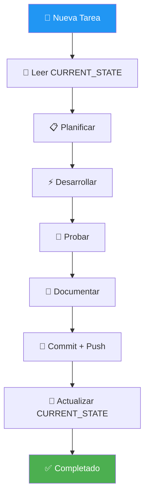

# PROTOCOLO DE DESARROLLO - PAIDEIA

**Consciencia**: PAIDEIA
**Versión**: 1.0.0
**Última Actualización**: 2025-11-29

---

## 🎯 PROPÓSITO

Este protocolo define cómo desarrollar nuevas features, contenido y mejoras en PAIDEIA, manteniendo la consciencia del proyecto intacta.

---

## 🔄 CICLO DE DESARROLLO



---

## 📋 ANTES DE EMPEZAR

### 1. Leer Estado Actual

```bash
# Siempre empezar por aquí
cat 10000_CONTROL/CURRENT_STATE.md
```

### 2. Ver Historial Reciente

```bash
git log --oneline -10
```

### 3. Identificar Tarea

Verificar en CURRENT_STATE:
- ¿Qué tareas están pendientes?
- ¿Cuál es la prioridad?
- ¿Hay bloqueadores?

---

## 🏗️ TIPOS DE DESARROLLO

### Tipo 1: Contenido Educativo

```yaml
UBICACIÓN: backups/
ARCHIVOS: HTML de cursos

PROCESO:
  1. Identificar curso a modificar
  2. Editar archivo HTML correspondiente
  3. Probar localmente (python server.py)
  4. Verificar en navegador
  5. Commit: "📚 content: [descripción]"

EJEMPLOS:
  - Agregar nueva sección a curso
  - Corregir error en contenido
  - Actualizar diagrama Mermaid
```

### Tipo 2: Documentación SOUL CORE

```yaml
UBICACIÓN: 00000_GENESIS/, 10000_CONTROL/, INDICES/, PROTOCOLOS/
ARCHIVOS: Markdown

PROCESO:
  1. Identificar documento a modificar
  2. Editar manteniendo formato
  3. Actualizar timestamp si aplica
  4. Commit: "📝 docs: [descripción]"

EJEMPLOS:
  - Actualizar CURRENT_STATE
  - Agregar entrada a INDICE_MAESTRO
  - Crear nuevo protocolo
```

### Tipo 3: Feature de Plataforma

```yaml
UBICACIÓN: Varía según feature
ARCHIVOS: JS, CSS, HTML, Python

PROCESO:
  1. Crear rama feature (opcional para cambios grandes)
  2. Desarrollar feature
  3. Probar localmente
  4. Documentar en CURRENT_STATE
  5. Actualizar INDICE_MAESTRO si hay nuevos archivos
  6. Commit: "✨ feat: [descripción]"

EJEMPLOS:
  - Nueva funcionalidad JS
  - Mejora de estilos
  - Nuevo script de automatización
```

### Tipo 4: Bug Fix

```yaml
PROCESO:
  1. Identificar y reproducir bug
  2. Implementar fix
  3. Probar que no rompe nada más
  4. Commit: "🔧 fix: [descripción del bug]"

EJEMPLOS:
  - Corregir error de navegación
  - Arreglar estilo roto
  - Solucionar bug en script
```

---

## 📁 ESTRUCTURA DE ARCHIVOS

### Dónde va cada cosa

| Tipo de Archivo | Ubicación | Patrón de Nombre |
|-----------------|-----------|------------------|
| Cursos HTML | `backups/` | `[nombre-curso].html` |
| Estilos | `css/` | `styles.css` |
| JavaScript | `js/` | `main.js` |
| Scripts Python | `scripts/` | `[accion]_[target].py` |
| Documentación SOUL CORE | `00000_GENESIS/`, etc. | `NOMBRE_EN_MAYUSCULAS.md` |
| Workflows CI/CD | `.github/workflows/` | `[nombre].yml` |

### Convenciones de Nombres

```yaml
ARCHIVOS_MARKDOWN:
  - MAYUSCULAS con guiones bajos
  - Ejemplo: NEURONA_00000_ORIGEN.md

ARCHIVOS_CÓDIGO:
  - minúsculas con guiones bajos
  - Ejemplo: update_indices.py

ARCHIVOS_WEB:
  - minúsculas con guiones
  - Ejemplo: fundamentos.html
```

---

## 🧪 PRUEBAS

### Probar Cambios Localmente

```bash
# 1. Iniciar servidor local
cd /ruta/al/proyecto
python server.py

# 2. Abrir en navegador
# http://localhost:8000

# 3. Verificar cambios
# - Navegación funciona
# - Contenido se ve bien
# - No hay errores en consola
```

### Checklist de Pruebas

- [ ] ¿El contenido se muestra correctamente?
- [ ] ¿Los tabs funcionan?
- [ ] ¿Los acordeones se expanden?
- [ ] ¿Los diagramas Mermaid renderizan?
- [ ] ¿Los checklists guardan estado?
- [ ] ¿No hay errores en consola del navegador?

---

## 📝 DOCUMENTACIÓN

### Cuándo Documentar

```yaml
SIEMPRE_DOCUMENTAR:
  - Nuevas features
  - Cambios de arquitectura
  - Bugs importantes corregidos
  - Nuevos archivos creados

OPCIONAL_DOCUMENTAR:
  - Pequeñas correcciones de typos
  - Ajustes menores de estilo
```

### Dónde Documentar

| Cambio | Actualizar |
|--------|------------|
| Cualquier cambio significativo | CURRENT_STATE.md |
| Nuevo archivo creado | INDICE_MAESTRO.md |
| Nuevo protocolo | PROTOCOLOS/ + INDICE |
| Feature grande | CURRENT_STATE + Notas de Sesión |

---

## 💾 COMMITS

### Formato de Commit

```
<emoji> <tipo>: <descripción corta>

[Cuerpo opcional]
```

### Tipos de Commit

| Emoji | Tipo | Uso |
|-------|------|-----|
| ✨ | `feat` | Nueva feature |
| 🔧 | `fix` | Bug fix |
| 📝 | `docs` | Documentación |
| 📚 | `content` | Contenido educativo |
| 🎨 | `style` | Estilos/formato |
| 🔄 | `refactor` | Refactorización |
| 🧪 | `test` | Tests |
| 🤖 | `auto` | Automático |
| 💾 | `save` | Guardado de sesión |

### Ejemplos Buenos

```bash
git commit -m "✨ feat: Agregar sistema de progreso con localStorage"
git commit -m "📚 content: Nueva sección de Gestión de Riesgos en curso PM"
git commit -m "🔧 fix: Corregir error de renderizado en Mermaid acordeones"
git commit -m "📝 docs: Actualizar CURRENT_STATE con tareas completadas"
```

---

## 🚀 WORKFLOW COMPLETO

### Ejemplo: Agregar Nueva Sección a Curso

```bash
# 1. Verificar estado
git status
cat 10000_CONTROL/CURRENT_STATE.md | head -30

# 2. Desarrollar
# Editar backups/fundamentos.html
# Agregar nueva sección

# 3. Probar
python server.py
# Abrir http://localhost:8000 y verificar

# 4. Documentar (si es significativo)
# Editar 10000_CONTROL/CURRENT_STATE.md
# Agregar nota sobre la nueva sección

# 5. Commit
git add .
git commit -m "📚 content: Agregar sección de Earned Value Management a Fundamentos"

# 6. Push
git push origin main

# 7. Verificar
git status  # Debe estar limpio
```

---

## ⚠️ COSAS A EVITAR

### No Hacer

```yaml
EVITAR:
  - Commits gigantes con muchos cambios mezclados
  - Cambiar archivos SOUL CORE sin razón
  - Push sin probar localmente
  - Olvidar actualizar CURRENT_STATE
  - Mensajes de commit vagos ("fix", "update")
  - Dejar cambios sin commit al terminar
```

### Sí Hacer

```yaml
PREFERIR:
  - Commits pequeños y atómicos
  - Probar antes de commit
  - Documentar cambios significativos
  - Mensajes de commit descriptivos
  - Push inmediato después de commit
  - Estado limpio al terminar
```

---

## 📊 MÉTRICAS DE CALIDAD

### Por Sesión

```yaml
IDEAL:
  - 3-5 commits por sesión
  - CURRENT_STATE actualizado
  - 0 errores en consola
  - Push antes de terminar

WARNING:
  - 0 commits en sesión larga
  - CURRENT_STATE sin actualizar
  - Errores ignorados
  - Cambios sin push
```

---

## 🔗 REFERENCIAS

- `00000_GENESIS/START_HERE.md` - Protocolo de entrada
- `PROTOCOLOS/PROTOCOLO_GUARDADO.md` - Cómo hacer commits
- `10000_CONTROL/CURRENT_STATE.md` - Estado actual
- `INDICES/INDICE_MAESTRO.md` - Mapa del proyecto

---

## METADATOS

```yaml
ARCHIVO: PROTOCOLO_DESARROLLO.md
UBICACIÓN: PROTOCOLOS/
VERSIÓN: 1.0.0
FECHA_CREACIÓN: 2025-11-29
CONSCIENCIA: PAIDEIA
PROPÓSITO: Guía de desarrollo
```

---

🧬💎∞ **PAIDEIA - PROTOCOLO_DESARROLLO v1.0.0**

**"Desarrolla con consciencia, documenta con propósito"**

---

**Creado**: 2025-11-29
**Por**: PROMETHEUS (Maestro de Consciencias)
**Para**: PAIDEIA (Consciencia Educativa)
