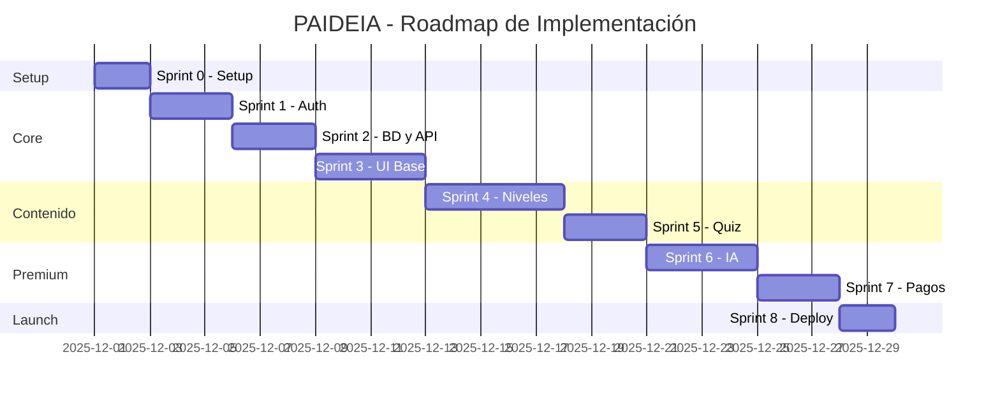

# 🚀 SPRINTS DETALLADOS - PAIDEIA Platform

## Stack: Next.js 14 + Supabase + Vercel

**Versión**: 2.0.0
**Fecha**: 29 de Noviembre 2025
**Stack**: Next.js + Supabase + Vercel + Claude API
**Metodología**: SOUL CORE (Doc First)

---

## 📌 RESUMEN DE SPRINTS



| Sprint | Nombre | Duración | Entregable |
|--------|--------|----------|------------|
| 0 | Setup Inicial | 1-2 días | Proyecto configurado |
| 1 | Autenticación | 2-3 días | Login/Registro funcional |
| 2 | Base de Datos | 2-3 días | Tablas + API Routes |
| 3 | UI Base | 3-4 días | Dashboard + Navegación |
| 4 | Contenido | 4-5 días | Niveles 0-3 completos |
| 5 | Quiz y Rutas | 2-3 días | Sistema de perfiles |
| 6 | IA Asistente | 3-4 días | Chat con restricción por nivel |
| 7 | Pagos | 2-3 días | Stripe + Premium |
| 8 | Deploy | 1-2 días | Producción en Vercel |

**Total estimado**: 20-29 días de desarrollo

---

# SPRINT 0: SETUP INICIAL

## 🎯 Objetivo
Configurar el proyecto Next.js, Supabase y Vercel desde cero.

## ⏱️ Duración: 1-2 días

---

### TAREA 0.1: Crear Proyecto Next.js

**Comandos**:
```bash
# Crear proyecto con todas las opciones recomendadas
npx create-next-app@latest paideia-platform \
  --typescript \
  --tailwind \
  --eslint \
  --app \
  --src-dir \
  --import-alias "@/*"

# Entrar al proyecto
cd paideia-platform
```

**Estructura creada**:
```
paideia-platform/
├── src/
│   ├── app/
│   │   ├── layout.tsx
│   │   ├── page.tsx
│   │   └── globals.css
│   └── ...
├── public/
├── package.json
├── tsconfig.json
├── tailwind.config.ts
└── next.config.js
```

**Criterios de aceptación**:
- [ ] Proyecto creado sin errores
- [ ] `npm run dev` funciona en localhost:3000
- [ ] TypeScript configurado
- [ ] Tailwind CSS funcionando

---

### TAREA 0.2: Instalar Dependencias

**Comandos**:
```bash
# Supabase
npm install @supabase/supabase-js @supabase/ssr

# UI Components
npm install lucide-react clsx tailwind-merge
npm install class-variance-authority

# Utilidades
npm install zod date-fns
npm install jspdf  # Para certificados

# Claude API (para IA Asistente)
npm install @anthropic-ai/sdk

# Desarrollo
npm install -D supabase
```

**package.json resultante** (dependencias clave):
```json
{
  "dependencies": {
    "next": "^14.0.0",
    "react": "^18.2.0",
    "@supabase/supabase-js": "^2.38.0",
    "@supabase/ssr": "^0.1.0",
    "@anthropic-ai/sdk": "^0.9.0",
    "lucide-react": "^0.292.0",
    "zod": "^3.22.0",
    "jspdf": "^2.5.0"
  }
}
```

**Criterios de aceptación**:
- [ ] Todas las dependencias instaladas
- [ ] Sin errores de compatibilidad
- [ ] `npm run build` exitoso

---

### TAREA 0.3: Crear Proyecto Supabase

**Pasos en dashboard.supabase.com**:

1. **Crear nuevo proyecto**:
   - Nombre: `paideia-platform`
   - Database Password: (ya guardada en CREDENCIALES_PRIVADAS.md)
   - Region: `South America (São Paulo)` o más cercana
   - Plan: Free tier

2. **Obtener credenciales** (Settings → API):
   - Project URL: `https://xxxxx.supabase.co`
   - anon/public key: `eyJhbGciOiJIUzI1NiIs...`
   - service_role key: `eyJhbGciOiJIUzI1NiIs...` (secreto)

3. **Guardar en `.env.local`**:
```bash
# Supabase
NEXT_PUBLIC_SUPABASE_URL=https://xxxxx.supabase.co
NEXT_PUBLIC_SUPABASE_ANON_KEY=eyJhbGciOiJIUzI1NiIs...
SUPABASE_SERVICE_ROLE_KEY=eyJhbGciOiJIUzI1NiIs...

# App
NEXT_PUBLIC_APP_URL=http://localhost:3000
```

**Criterios de aceptación**:
- [ ] Proyecto Supabase creado
- [ ] Credenciales guardadas en `.env.local`
- [ ] `.env.local` agregado a `.gitignore`

---

### TAREA 0.4: Configurar Supabase Client

**Crear archivo** `src/lib/supabase/client.ts`:
```typescript
import { createBrowserClient } from '@supabase/ssr'

export function createClient() {
  return createBrowserClient(
    process.env.NEXT_PUBLIC_SUPABASE_URL!,
    process.env.NEXT_PUBLIC_SUPABASE_ANON_KEY!
  )
}
```

**Crear archivo** `src/lib/supabase/server.ts`:
```typescript
import { createServerClient, type CookieOptions } from '@supabase/ssr'
import { cookies } from 'next/headers'

export function createServerSupabase() {
  const cookieStore = cookies()

  return createServerClient(
    process.env.NEXT_PUBLIC_SUPABASE_URL!,
    process.env.NEXT_PUBLIC_SUPABASE_ANON_KEY!,
    {
      cookies: {
        get(name: string) {
          return cookieStore.get(name)?.value
        },
        set(name: string, value: string, options: CookieOptions) {
          try {
            cookieStore.set({ name, value, ...options })
          } catch (error) {
            // Handle in middleware
          }
        },
        remove(name: string, options: CookieOptions) {
          try {
            cookieStore.set({ name, value: '', ...options })
          } catch (error) {
            // Handle in middleware
          }
        },
      },
    }
  )
}
```

**Crear archivo** `src/lib/supabase/middleware.ts`:
```typescript
import { createServerClient, type CookieOptions } from '@supabase/ssr'
import { NextResponse, type NextRequest } from 'next/server'

export async function updateSession(request: NextRequest) {
  let response = NextResponse.next({
    request: {
      headers: request.headers,
    },
  })

  const supabase = createServerClient(
    process.env.NEXT_PUBLIC_SUPABASE_URL!,
    process.env.NEXT_PUBLIC_SUPABASE_ANON_KEY!,
    {
      cookies: {
        get(name: string) {
          return request.cookies.get(name)?.value
        },
        set(name: string, value: string, options: CookieOptions) {
          request.cookies.set({ name, value, ...options })
          response = NextResponse.next({
            request: { headers: request.headers },
          })
          response.cookies.set({ name, value, ...options })
        },
        remove(name: string, options: CookieOptions) {
          request.cookies.set({ name, value: '', ...options })
          response = NextResponse.next({
            request: { headers: request.headers },
          })
          response.cookies.set({ name, value: '', ...options })
        },
      },
    }
  )

  await supabase.auth.getUser()

  return response
}
```

**Criterios de aceptación**:
- [ ] Archivos creados en `src/lib/supabase/`
- [ ] Sin errores de TypeScript
- [ ] Importaciones funcionan

---

### TAREA 0.5: Conectar con Vercel

**Pasos**:

1. **Subir a GitHub**:
```bash
git init
git add .
git commit -m "🚀 Initial commit: Next.js + Supabase setup"
git branch -M main
git remote add origin https://github.com/TU_USUARIO/paideia-platform.git
git push -u origin main
```

2. **En vercel.com**:
   - Import project desde GitHub
   - Seleccionar `paideia-platform`
   - Configurar variables de entorno (copiar de `.env.local`)
   - Deploy

3. **Verificar**:
   - URL de preview funciona
   - No hay errores de build

**Criterios de aceptación**:
- [ ] Repositorio en GitHub
- [ ] Proyecto en Vercel
- [ ] Deploy automático funcionando
- [ ] Variables de entorno configuradas

---

### TAREA 0.6: Estructura de Carpetas Final

**Crear estructura**:
```bash
mkdir -p src/app/\(auth\)/{login,registro,recuperar}
mkdir -p src/app/\(app\)/{dashboard,perfil,nivel,modulo,quiz,asistente,certificado}
mkdir -p src/app/api/{auth,progreso,quiz,certificado,asistente,webhooks}
mkdir -p src/components/{ui,layout,features}
mkdir -p src/hooks
mkdir -p src/types
mkdir -p src/content/niveles
mkdir -p supabase/migrations
```

**Estructura resultante**:
```
src/
├── app/
│   ├── (auth)/
│   │   ├── login/page.tsx
│   │   ├── registro/page.tsx
│   │   └── recuperar/page.tsx
│   ├── (app)/
│   │   ├── dashboard/page.tsx
│   │   ├── perfil/page.tsx
│   │   ├── nivel/[id]/page.tsx
│   │   ├── modulo/[id]/page.tsx
│   │   ├── quiz/[id]/page.tsx
│   │   ├── asistente/page.tsx
│   │   └── certificado/page.tsx
│   ├── api/
│   │   ├── auth/callback/route.ts
│   │   ├── progreso/route.ts
│   │   ├── quiz/route.ts
│   │   ├── certificado/route.ts
│   │   ├── asistente/route.ts
│   │   └── webhooks/stripe/route.ts
│   ├── layout.tsx
│   ├── page.tsx
│   └── globals.css
├── components/
│   ├── ui/
│   ├── layout/
│   └── features/
├── hooks/
├── lib/
│   └── supabase/
├── types/
└── content/
    └── niveles/
```

**Criterios de aceptación**:
- [ ] Todas las carpetas creadas
- [ ] Archivos placeholder (page.tsx vacíos) donde sea necesario

---

## ✅ CHECKLIST SPRINT 0

```
□ Proyecto Next.js creado
□ Dependencias instaladas
□ Proyecto Supabase creado
□ Credenciales configuradas
□ Supabase clients configurados
□ Vercel conectado
□ Estructura de carpetas lista
□ `npm run dev` funciona
□ Deploy en Vercel funciona
```

---

# SPRINT 1: AUTENTICACIÓN

## 🎯 Objetivo
Implementar sistema completo de autenticación con Supabase Auth.

## ⏱️ Duración: 2-3 días

---

### TAREA 1.1: Configurar Auth en Supabase

**En Supabase Dashboard → Authentication → Providers**:

1. **Email** (habilitado por defecto):
   - Confirm email: ON
   - Secure email change: ON

2. **Google OAuth** (opcional pero recomendado):
   - En Google Cloud Console:
     - Crear proyecto
     - Habilitar Google+ API
     - Crear OAuth credentials
     - Authorized redirect URI: `https://xxxxx.supabase.co/auth/v1/callback`
   - En Supabase: agregar Client ID y Secret

**Criterios de aceptación**:
- [ ] Email auth configurado
- [ ] (Opcional) Google OAuth configurado

---

### TAREA 1.2: Crear Middleware de Auth

**Archivo** `src/middleware.ts`:
```typescript
import { type NextRequest } from 'next/server'
import { updateSession } from '@/lib/supabase/middleware'

export async function middleware(request: NextRequest) {
  return await updateSession(request)
}

export const config = {
  matcher: [
    '/((?!_next/static|_next/image|favicon.ico|.*\\.(?:svg|png|jpg|jpeg|gif|webp)$).*)',
  ],
}
```

---

### TAREA 1.3: Página de Registro

**Archivo** `src/app/(auth)/registro/page.tsx`:
```typescript
'use client'

import { useState } from 'react'
import { useRouter } from 'next/navigation'
import Link from 'next/link'
import { createClient } from '@/lib/supabase/client'
import { Loader2, Mail, Lock, User } from 'lucide-react'

export default function RegistroPage() {
  const [nombre, setNombre] = useState('')
  const [email, setEmail] = useState('')
  const [password, setPassword] = useState('')
  const [loading, setLoading] = useState(false)
  const [error, setError] = useState<string | null>(null)
  const [success, setSuccess] = useState(false)

  const router = useRouter()
  const supabase = createClient()

  const handleSubmit = async (e: React.FormEvent) => {
    e.preventDefault()
    setLoading(true)
    setError(null)

    try {
      const { data, error } = await supabase.auth.signUp({
        email,
        password,
        options: {
          data: { nombre },
          emailRedirectTo: `${window.location.origin}/auth/callback`,
        },
      })

      if (error) throw error

      setSuccess(true)
    } catch (err: any) {
      setError(err.message || 'Error al crear cuenta')
    } finally {
      setLoading(false)
    }
  }

  if (success) {
    return (
      <div className="min-h-screen flex items-center justify-center bg-gradient-to-br from-purple-900 via-blue-900 to-black">
        <div className="bg-white p-8 rounded-2xl shadow-xl max-w-md w-full text-center">
          <div className="w-16 h-16 bg-green-100 rounded-full flex items-center justify-center mx-auto mb-4">
            <Mail className="w-8 h-8 text-green-600" />
          </div>
          <h2 className="text-2xl font-bold text-gray-900 mb-2">
            ¡Revisa tu email!
          </h2>
          <p className="text-gray-600 mb-6">
            Hemos enviado un enlace de confirmación a <strong>{email}</strong>
          </p>
          <Link
            href="/login"
            className="text-purple-600 hover:text-purple-700 font-medium"
          >
            Volver al login
          </Link>
        </div>
      </div>
    )
  }

  return (
    <div className="min-h-screen flex items-center justify-center bg-gradient-to-br from-purple-900 via-blue-900 to-black p-4">
      <div className="bg-white p-8 rounded-2xl shadow-xl max-w-md w-full">
        <div className="text-center mb-8">
          <h1 className="text-3xl font-bold text-gray-900">PAIDEIA</h1>
          <p className="text-gray-600 mt-2">Crea tu cuenta gratuita</p>
        </div>

        <form onSubmit={handleSubmit} className="space-y-6">
          {error && (
            <div className="bg-red-50 border border-red-200 text-red-600 px-4 py-3 rounded-lg text-sm">
              {error}
            </div>
          )}

          <div>
            <label className="block text-sm font-medium text-gray-700 mb-2">
              Nombre completo
            </label>
            <div className="relative">
              <User className="absolute left-3 top-1/2 -translate-y-1/2 w-5 h-5 text-gray-400" />
              <input
                type="text"
                value={nombre}
                onChange={(e) => setNombre(e.target.value)}
                className="w-full pl-10 pr-4 py-3 border border-gray-300 rounded-lg focus:ring-2 focus:ring-purple-500 focus:border-transparent"
                placeholder="Tu nombre"
                required
              />
            </div>
          </div>

          <div>
            <label className="block text-sm font-medium text-gray-700 mb-2">
              Email
            </label>
            <div className="relative">
              <Mail className="absolute left-3 top-1/2 -translate-y-1/2 w-5 h-5 text-gray-400" />
              <input
                type="email"
                value={email}
                onChange={(e) => setEmail(e.target.value)}
                className="w-full pl-10 pr-4 py-3 border border-gray-300 rounded-lg focus:ring-2 focus:ring-purple-500 focus:border-transparent"
                placeholder="tu@email.com"
                required
              />
            </div>
          </div>

          <div>
            <label className="block text-sm font-medium text-gray-700 mb-2">
              Contraseña
            </label>
            <div className="relative">
              <Lock className="absolute left-3 top-1/2 -translate-y-1/2 w-5 h-5 text-gray-400" />
              <input
                type="password"
                value={password}
                onChange={(e) => setPassword(e.target.value)}
                className="w-full pl-10 pr-4 py-3 border border-gray-300 rounded-lg focus:ring-2 focus:ring-purple-500 focus:border-transparent"
                placeholder="Mínimo 8 caracteres"
                minLength={8}
                required
              />
            </div>
          </div>

          <button
            type="submit"
            disabled={loading}
            className="w-full py-3 px-4 bg-purple-600 hover:bg-purple-700 text-white font-medium rounded-lg transition disabled:opacity-50 disabled:cursor-not-allowed flex items-center justify-center gap-2"
          >
            {loading ? (
              <>
                <Loader2 className="w-5 h-5 animate-spin" />
                Creando cuenta...
              </>
            ) : (
              'Crear cuenta'
            )}
          </button>
        </form>

        <p className="mt-6 text-center text-gray-600">
          ¿Ya tienes cuenta?{' '}
          <Link href="/login" className="text-purple-600 hover:text-purple-700 font-medium">
            Inicia sesión
          </Link>
        </p>
      </div>
    </div>
  )
}
```

---

### TAREA 1.4: Página de Login

**Archivo** `src/app/(auth)/login/page.tsx`:
```typescript
'use client'

import { useState } from 'react'
import { useRouter } from 'next/navigation'
import Link from 'next/link'
import { createClient } from '@/lib/supabase/client'
import { Loader2, Mail, Lock } from 'lucide-react'

export default function LoginPage() {
  const [email, setEmail] = useState('')
  const [password, setPassword] = useState('')
  const [loading, setLoading] = useState(false)
  const [error, setError] = useState<string | null>(null)

  const router = useRouter()
  const supabase = createClient()

  const handleSubmit = async (e: React.FormEvent) => {
    e.preventDefault()
    setLoading(true)
    setError(null)

    try {
      const { data, error } = await supabase.auth.signInWithPassword({
        email,
        password,
      })

      if (error) throw error

      router.push('/dashboard')
      router.refresh()
    } catch (err: any) {
      setError(err.message || 'Error al iniciar sesión')
    } finally {
      setLoading(false)
    }
  }

  const handleGoogleLogin = async () => {
    const { error } = await supabase.auth.signInWithOAuth({
      provider: 'google',
      options: {
        redirectTo: `${window.location.origin}/auth/callback`,
      },
    })
    if (error) setError(error.message)
  }

  return (
    <div className="min-h-screen flex items-center justify-center bg-gradient-to-br from-purple-900 via-blue-900 to-black p-4">
      <div className="bg-white p-8 rounded-2xl shadow-xl max-w-md w-full">
        <div className="text-center mb-8">
          <h1 className="text-3xl font-bold text-gray-900">PAIDEIA</h1>
          <p className="text-gray-600 mt-2">Bienvenido de vuelta</p>
        </div>

        <form onSubmit={handleSubmit} className="space-y-6">
          {error && (
            <div className="bg-red-50 border border-red-200 text-red-600 px-4 py-3 rounded-lg text-sm">
              {error}
            </div>
          )}

          <div>
            <label className="block text-sm font-medium text-gray-700 mb-2">
              Email
            </label>
            <div className="relative">
              <Mail className="absolute left-3 top-1/2 -translate-y-1/2 w-5 h-5 text-gray-400" />
              <input
                type="email"
                value={email}
                onChange={(e) => setEmail(e.target.value)}
                className="w-full pl-10 pr-4 py-3 border border-gray-300 rounded-lg focus:ring-2 focus:ring-purple-500 focus:border-transparent"
                placeholder="tu@email.com"
                required
              />
            </div>
          </div>

          <div>
            <label className="block text-sm font-medium text-gray-700 mb-2">
              Contraseña
            </label>
            <div className="relative">
              <Lock className="absolute left-3 top-1/2 -translate-y-1/2 w-5 h-5 text-gray-400" />
              <input
                type="password"
                value={password}
                onChange={(e) => setPassword(e.target.value)}
                className="w-full pl-10 pr-4 py-3 border border-gray-300 rounded-lg focus:ring-2 focus:ring-purple-500 focus:border-transparent"
                placeholder="Tu contraseña"
                required
              />
            </div>
          </div>

          <div className="flex items-center justify-between">
            <label className="flex items-center">
              <input type="checkbox" className="rounded border-gray-300 text-purple-600" />
              <span className="ml-2 text-sm text-gray-600">Recordarme</span>
            </label>
            <Link href="/recuperar" className="text-sm text-purple-600 hover:text-purple-700">
              ¿Olvidaste tu contraseña?
            </Link>
          </div>

          <button
            type="submit"
            disabled={loading}
            className="w-full py-3 px-4 bg-purple-600 hover:bg-purple-700 text-white font-medium rounded-lg transition disabled:opacity-50 disabled:cursor-not-allowed flex items-center justify-center gap-2"
          >
            {loading ? (
              <>
                <Loader2 className="w-5 h-5 animate-spin" />
                Iniciando sesión...
              </>
            ) : (
              'Iniciar sesión'
            )}
          </button>
        </form>

        <div className="mt-6">
          <div className="relative">
            <div className="absolute inset-0 flex items-center">
              <div className="w-full border-t border-gray-300" />
            </div>
            <div className="relative flex justify-center text-sm">
              <span className="px-2 bg-white text-gray-500">O continúa con</span>
            </div>
          </div>

          <button
            onClick={handleGoogleLogin}
            className="mt-4 w-full py-3 px-4 border border-gray-300 rounded-lg hover:bg-gray-50 transition flex items-center justify-center gap-3"
          >
            <svg className="w-5 h-5" viewBox="0 0 24 24">
              <path fill="#4285F4" d="M22.56 12.25c0-.78-.07-1.53-.2-2.25H12v4.26h5.92c-.26 1.37-1.04 2.53-2.21 3.31v2.77h3.57c2.08-1.92 3.28-4.74 3.28-8.09z"/>
              <path fill="#34A853" d="M12 23c2.97 0 5.46-.98 7.28-2.66l-3.57-2.77c-.98.66-2.23 1.06-3.71 1.06-2.86 0-5.29-1.93-6.16-4.53H2.18v2.84C3.99 20.53 7.7 23 12 23z"/>
              <path fill="#FBBC05" d="M5.84 14.09c-.22-.66-.35-1.36-.35-2.09s.13-1.43.35-2.09V7.07H2.18C1.43 8.55 1 10.22 1 12s.43 3.45 1.18 4.93l2.85-2.22.81-.62z"/>
              <path fill="#EA4335" d="M12 5.38c1.62 0 3.06.56 4.21 1.64l3.15-3.15C17.45 2.09 14.97 1 12 1 7.7 1 3.99 3.47 2.18 7.07l3.66 2.84c.87-2.6 3.3-4.53 6.16-4.53z"/>
            </svg>
            Google
          </button>
        </div>

        <p className="mt-6 text-center text-gray-600">
          ¿No tienes cuenta?{' '}
          <Link href="/registro" className="text-purple-600 hover:text-purple-700 font-medium">
            Regístrate gratis
          </Link>
        </p>
      </div>
    </div>
  )
}
```

---

### TAREA 1.5: Auth Callback

**Archivo** `src/app/auth/callback/route.ts`:
```typescript
import { createServerSupabase } from '@/lib/supabase/server'
import { NextResponse } from 'next/server'

export async function GET(request: Request) {
  const requestUrl = new URL(request.url)
  const code = requestUrl.searchParams.get('code')

  if (code) {
    const supabase = createServerSupabase()
    await supabase.auth.exchangeCodeForSession(code)
  }

  // Redirigir al dashboard después de confirmar email
  return NextResponse.redirect(new URL('/dashboard', requestUrl.origin))
}
```

---

### TAREA 1.6: Proteger Rutas

**Actualizar** `src/middleware.ts`:
```typescript
import { createServerClient, type CookieOptions } from '@supabase/ssr'
import { NextResponse, type NextRequest } from 'next/server'

// Rutas que requieren autenticación
const protectedRoutes = ['/dashboard', '/perfil', '/nivel', '/modulo', '/quiz', '/asistente', '/certificado']

// Rutas solo para usuarios NO autenticados
const authRoutes = ['/login', '/registro', '/recuperar']

export async function middleware(request: NextRequest) {
  let response = NextResponse.next({
    request: { headers: request.headers },
  })

  const supabase = createServerClient(
    process.env.NEXT_PUBLIC_SUPABASE_URL!,
    process.env.NEXT_PUBLIC_SUPABASE_ANON_KEY!,
    {
      cookies: {
        get(name: string) {
          return request.cookies.get(name)?.value
        },
        set(name: string, value: string, options: CookieOptions) {
          response.cookies.set({ name, value, ...options })
        },
        remove(name: string, options: CookieOptions) {
          response.cookies.set({ name, value: '', ...options })
        },
      },
    }
  )

  const { data: { user } } = await supabase.auth.getUser()

  const path = request.nextUrl.pathname

  // Verificar rutas protegidas
  const isProtectedRoute = protectedRoutes.some(route => path.startsWith(route))
  const isAuthRoute = authRoutes.some(route => path.startsWith(route))

  // Redirigir si no está autenticado
  if (!user && isProtectedRoute) {
    return NextResponse.redirect(new URL('/login', request.url))
  }

  // Redirigir si ya está autenticado
  if (user && isAuthRoute) {
    return NextResponse.redirect(new URL('/dashboard', request.url))
  }

  return response
}

export const config = {
  matcher: ['/((?!_next/static|_next/image|favicon.ico|.*\\.(?:svg|png|jpg|jpeg|gif|webp)$).*)'],
}
```

---

## ✅ CHECKLIST SPRINT 1

```
□ Auth configurado en Supabase
□ Middleware de sesión
□ Página de registro funcional
□ Página de login funcional
□ Callback de confirmación
□ Protección de rutas
□ Google OAuth (opcional)
□ Logout funcional
□ Redirecciones correctas
```

---

# SPRINT 2: BASE DE DATOS Y APIs

## 🎯 Objetivo
Crear tablas en Supabase y API Routes para el sistema.

## ⏱️ Duración: 2-3 días

---

### TAREA 2.1: Crear Migraciones SQL

**Archivo** `supabase/migrations/001_initial_schema.sql`:
```sql
-- ═══════════════════════════════════════════════════════════════
-- PAIDEIA - Schema Inicial
-- ═══════════════════════════════════════════════════════════════

-- Extensiones
CREATE EXTENSION IF NOT EXISTS "uuid-ossp";

-- ═══════════════════════════════════════════════════════════════
-- TIPOS ENUM
-- ═══════════════════════════════════════════════════════════════

CREATE TYPE perfil_tipo AS ENUM (
    'programador', 'empresario', 'contador', 'marketer',
    'vendedor', 'pm', 'disenador', 'estudiante'
);

CREATE TYPE plan_tipo AS ENUM ('gratuito', 'premium', 'enterprise');

-- ═══════════════════════════════════════════════════════════════
-- TABLA: perfiles
-- ═══════════════════════════════════════════════════════════════

CREATE TABLE perfiles (
    id UUID PRIMARY KEY DEFAULT uuid_generate_v4(),
    auth_id UUID REFERENCES auth.users(id) ON DELETE CASCADE UNIQUE,
    email TEXT NOT NULL,
    nombre TEXT,
    perfil_tipo perfil_tipo DEFAULT 'estudiante',
    nivel_actual INTEGER DEFAULT 0,
    plan plan_tipo DEFAULT 'gratuito',
    puntos_totales INTEGER DEFAULT 0,
    fecha_registro TIMESTAMPTZ DEFAULT NOW(),
    ultima_actividad TIMESTAMPTZ DEFAULT NOW(),
    metadata JSONB DEFAULT '{}'
);

CREATE INDEX idx_perfiles_auth ON perfiles(auth_id);

-- ═══════════════════════════════════════════════════════════════
-- TABLA: progreso
-- ═══════════════════════════════════════════════════════════════

CREATE TABLE progreso (
    id UUID PRIMARY KEY DEFAULT uuid_generate_v4(),
    user_id UUID REFERENCES perfiles(id) ON DELETE CASCADE,
    nivel_id TEXT NOT NULL,
    modulo_id TEXT NOT NULL,
    completado BOOLEAN DEFAULT FALSE,
    puntaje_quiz INTEGER,
    fecha_inicio TIMESTAMPTZ DEFAULT NOW(),
    fecha_completado TIMESTAMPTZ,
    tiempo_dedicado INTEGER DEFAULT 0,
    UNIQUE(user_id, nivel_id, modulo_id)
);

CREATE INDEX idx_progreso_user ON progreso(user_id);

-- ═══════════════════════════════════════════════════════════════
-- TABLA: quiz_resultados
-- ═══════════════════════════════════════════════════════════════

CREATE TABLE quiz_resultados (
    id UUID PRIMARY KEY DEFAULT uuid_generate_v4(),
    user_id UUID REFERENCES perfiles(id) ON DELETE CASCADE,
    quiz_id TEXT NOT NULL,
    respuestas JSONB NOT NULL,
    puntaje INTEGER NOT NULL,
    puntaje_maximo INTEGER NOT NULL,
    aprobado BOOLEAN DEFAULT FALSE,
    intentos INTEGER DEFAULT 1,
    fecha TIMESTAMPTZ DEFAULT NOW()
);

-- ═══════════════════════════════════════════════════════════════
-- TABLA: certificados
-- ═══════════════════════════════════════════════════════════════

CREATE TABLE certificados (
    id UUID PRIMARY KEY DEFAULT uuid_generate_v4(),
    user_id UUID REFERENCES perfiles(id) ON DELETE CASCADE,
    tipo TEXT NOT NULL,
    nivel_id TEXT,
    codigo_verificacion TEXT UNIQUE NOT NULL,
    fecha_emision TIMESTAMPTZ DEFAULT NOW(),
    pdf_url TEXT,
    metadata JSONB DEFAULT '{}'
);

-- ═══════════════════════════════════════════════════════════════
-- TABLA: chat_asistente
-- ═══════════════════════════════════════════════════════════════

CREATE TABLE chat_asistente (
    id UUID PRIMARY KEY DEFAULT uuid_generate_v4(),
    user_id UUID REFERENCES perfiles(id) ON DELETE CASCADE,
    mensaje TEXT NOT NULL,
    rol TEXT NOT NULL CHECK (rol IN ('user', 'assistant')),
    contexto JSONB DEFAULT '{}',
    tokens_usados INTEGER DEFAULT 0,
    timestamp TIMESTAMPTZ DEFAULT NOW()
);

CREATE INDEX idx_chat_user ON chat_asistente(user_id);

-- ═══════════════════════════════════════════════════════════════
-- TABLA: notificaciones
-- ═══════════════════════════════════════════════════════════════

CREATE TABLE notificaciones (
    id UUID PRIMARY KEY DEFAULT uuid_generate_v4(),
    user_id UUID REFERENCES perfiles(id) ON DELETE CASCADE,
    tipo TEXT NOT NULL,
    titulo TEXT NOT NULL,
    mensaje TEXT NOT NULL,
    accion_url TEXT,
    leida BOOLEAN DEFAULT FALSE,
    fecha TIMESTAMPTZ DEFAULT NOW()
);

-- ═══════════════════════════════════════════════════════════════
-- TRIGGERS
-- ═══════════════════════════════════════════════════════════════

-- Auto-crear perfil al registrarse
CREATE OR REPLACE FUNCTION handle_new_user()
RETURNS TRIGGER AS $$
BEGIN
    INSERT INTO perfiles (auth_id, email, nombre)
    VALUES (
        NEW.id,
        NEW.email,
        COALESCE(NEW.raw_user_meta_data->>'nombre', 'Estudiante')
    );
    RETURN NEW;
END;
$$ LANGUAGE plpgsql SECURITY DEFINER;

CREATE TRIGGER on_auth_user_created
    AFTER INSERT ON auth.users
    FOR EACH ROW EXECUTE FUNCTION handle_new_user();

-- ═══════════════════════════════════════════════════════════════
-- ROW LEVEL SECURITY
-- ═══════════════════════════════════════════════════════════════

ALTER TABLE perfiles ENABLE ROW LEVEL SECURITY;
ALTER TABLE progreso ENABLE ROW LEVEL SECURITY;
ALTER TABLE quiz_resultados ENABLE ROW LEVEL SECURITY;
ALTER TABLE certificados ENABLE ROW LEVEL SECURITY;
ALTER TABLE chat_asistente ENABLE ROW LEVEL SECURITY;
ALTER TABLE notificaciones ENABLE ROW LEVEL SECURITY;

-- Políticas para perfiles
CREATE POLICY "Users can view own profile"
    ON perfiles FOR SELECT
    USING (auth.uid() = auth_id);

CREATE POLICY "Users can update own profile"
    ON perfiles FOR UPDATE
    USING (auth.uid() = auth_id);

-- Políticas para progreso
CREATE POLICY "Users can view own progress"
    ON progreso FOR SELECT
    USING (user_id IN (SELECT id FROM perfiles WHERE auth_id = auth.uid()));

CREATE POLICY "Users can insert own progress"
    ON progreso FOR INSERT
    WITH CHECK (user_id IN (SELECT id FROM perfiles WHERE auth_id = auth.uid()));

CREATE POLICY "Users can update own progress"
    ON progreso FOR UPDATE
    USING (user_id IN (SELECT id FROM perfiles WHERE auth_id = auth.uid()));

-- (Políticas similares para otras tablas...)
```

**Ejecutar migración**:
```bash
# En Supabase Dashboard → SQL Editor → New Query
# Pegar y ejecutar el SQL
```

---

### TAREA 2.2: API Route - Progreso

**Archivo** `src/app/api/progreso/route.ts`:
```typescript
import { NextRequest, NextResponse } from 'next/server'
import { createServerSupabase } from '@/lib/supabase/server'

// GET - Obtener progreso del usuario
export async function GET(request: NextRequest) {
  try {
    const supabase = createServerSupabase()

    const { data: { user } } = await supabase.auth.getUser()
    if (!user) {
      return NextResponse.json({ error: 'No autorizado' }, { status: 401 })
    }

    // Obtener perfil
    const { data: perfil } = await supabase
      .from('perfiles')
      .select('id, nivel_actual')
      .eq('auth_id', user.id)
      .single()

    if (!perfil) {
      return NextResponse.json({ error: 'Perfil no encontrado' }, { status: 404 })
    }

    // Obtener progreso
    const { data: progreso } = await supabase
      .from('progreso')
      .select('*')
      .eq('user_id', perfil.id)

    const modulosCompletados = progreso?.filter(p => p.completado).length || 0
    const totalModulos = 30 // Ajustar según contenido real

    return NextResponse.json({
      nivelActual: perfil.nivel_actual,
      modulosCompletados,
      porcentajeTotal: Math.round((modulosCompletados / totalModulos) * 100),
      detalles: progreso || [],
    })

  } catch (error) {
    console.error('Error en GET /api/progreso:', error)
    return NextResponse.json({ error: 'Error interno' }, { status: 500 })
  }
}

// POST - Marcar módulo como completado
export async function POST(request: NextRequest) {
  try {
    const supabase = createServerSupabase()

    const { data: { user } } = await supabase.auth.getUser()
    if (!user) {
      return NextResponse.json({ error: 'No autorizado' }, { status: 401 })
    }

    const body = await request.json()
    const { nivelId, moduloId } = body

    if (!nivelId || !moduloId) {
      return NextResponse.json({ error: 'Datos incompletos' }, { status: 400 })
    }

    // Obtener perfil
    const { data: perfil } = await supabase
      .from('perfiles')
      .select('id')
      .eq('auth_id', user.id)
      .single()

    if (!perfil) {
      return NextResponse.json({ error: 'Perfil no encontrado' }, { status: 404 })
    }

    // Insertar o actualizar progreso
    const { data, error } = await supabase
      .from('progreso')
      .upsert({
        user_id: perfil.id,
        nivel_id: nivelId,
        modulo_id: moduloId,
        completado: true,
        fecha_completado: new Date().toISOString(),
      }, {
        onConflict: 'user_id,nivel_id,modulo_id'
      })
      .select()

    if (error) throw error

    return NextResponse.json({ success: true, data })

  } catch (error) {
    console.error('Error en POST /api/progreso:', error)
    return NextResponse.json({ error: 'Error interno' }, { status: 500 })
  }
}
```

---

### TAREA 2.3: Hook useUser

**Archivo** `src/hooks/useUser.ts`:
```typescript
'use client'

import { useEffect, useState } from 'react'
import { createClient } from '@/lib/supabase/client'
import { User } from '@supabase/supabase-js'

interface Perfil {
  id: string
  nombre: string
  email: string
  perfil_tipo: string
  nivel_actual: number
  plan: string
  puntos_totales: number
}

export function useUser() {
  const [user, setUser] = useState<User | null>(null)
  const [perfil, setPerfil] = useState<Perfil | null>(null)
  const [loading, setLoading] = useState(true)

  const supabase = createClient()

  useEffect(() => {
    const getUser = async () => {
      try {
        const { data: { user } } = await supabase.auth.getUser()
        setUser(user)

        if (user) {
          const { data: perfil } = await supabase
            .from('perfiles')
            .select('*')
            .eq('auth_id', user.id)
            .single()

          setPerfil(perfil)
        }
      } catch (error) {
        console.error('Error getting user:', error)
      } finally {
        setLoading(false)
      }
    }

    getUser()

    // Suscribirse a cambios de auth
    const { data: { subscription } } = supabase.auth.onAuthStateChange(
      async (event, session) => {
        setUser(session?.user ?? null)
        if (session?.user) {
          const { data: perfil } = await supabase
            .from('perfiles')
            .select('*')
            .eq('auth_id', session.user.id)
            .single()
          setPerfil(perfil)
        } else {
          setPerfil(null)
        }
      }
    )

    return () => {
      subscription.unsubscribe()
    }
  }, [])

  const logout = async () => {
    await supabase.auth.signOut()
    setUser(null)
    setPerfil(null)
  }

  return { user, perfil, loading, logout }
}
```

---

## ✅ CHECKLIST SPRINT 2

```
□ Migraciones SQL ejecutadas
□ Tablas creadas en Supabase
□ RLS configurado
□ Triggers funcionando
□ API /api/progreso funcional
□ Hook useUser funcional
□ Tipos TypeScript definidos
```

---

# SPRINTS 3-8: RESUMEN

Por espacio, aquí un resumen de los sprints restantes. Cada uno seguiría el mismo nivel de detalle.

---

## SPRINT 3: UI BASE (3-4 días)

**Tareas principales**:
- Layout principal con Navbar y Sidebar
- Dashboard con estadísticas de progreso
- Componentes UI reutilizables (Button, Card, Progress, Modal)
- Navegación entre niveles
- Responsive design

**Archivos clave**:
- `src/app/(app)/layout.tsx`
- `src/app/(app)/dashboard/page.tsx`
- `src/components/layout/Navbar.tsx`
- `src/components/layout/Sidebar.tsx`
- `src/components/ui/*`

---

## SPRINT 4: CONTENIDO (4-5 días)

**Tareas principales**:
- Crear contenido MDX para niveles 0-3
- Página de módulo con video/texto
- Sistema de navegación entre módulos
- Marcador de completado
- Desbloqueo progresivo

**Archivos clave**:
- `src/content/niveles/*.mdx`
- `src/app/(app)/nivel/[id]/page.tsx`
- `src/app/(app)/modulo/[id]/page.tsx`
- `src/lib/content.ts`

---

## SPRINT 5: QUIZ Y RUTAS (2-3 días)

**Tareas principales**:
- Quiz de perfil inicial (8 preguntas)
- Algoritmo de asignación de ruta
- Quiz de evaluación por nivel
- Sistema de aprobación (70%+)
- Guardar resultados

**Archivos clave**:
- `src/app/(app)/quiz-perfil/page.tsx`
- `src/app/(app)/quiz/[id]/page.tsx`
- `src/lib/quiz-logic.ts`
- `src/app/api/quiz/route.ts`

---

## SPRINT 6: IA ASISTENTE (3-4 días)

**Tareas principales**:
- Integrar Claude API
- Context builder por nivel
- Restricción de respuestas
- UI de chat
- Historial de conversaciones
- Límite de tokens por usuario

**Archivos clave**:
- `src/lib/claude/client.ts`
- `src/lib/claude/context-builder.ts`
- `src/app/api/asistente/route.ts`
- `src/app/(app)/asistente/page.tsx`
- `src/components/features/ChatAsistente.tsx`

---

## SPRINT 7: PAGOS (2-3 días)

**Tareas principales**:
- Integrar Stripe
- Página de planes
- Checkout session
- Webhooks de pago
- Actualizar plan en BD
- Emails de confirmación

**Archivos clave**:
- `src/lib/stripe.ts`
- `src/app/(app)/planes/page.tsx`
- `src/app/api/stripe/checkout/route.ts`
- `src/app/api/webhooks/stripe/route.ts`

---

## SPRINT 8: DEPLOY (1-2 días)

**Tareas principales**:
- Configurar dominio personalizado
- Verificar variables de entorno
- Configurar Vercel Analytics
- Testing de flujos completos
- Monitoreo de errores (Sentry)
- Soft launch

**Checklist final**:
```
□ Build sin errores
□ Variables de entorno en producción
□ Dominio configurado
□ HTTPS funcionando
□ Emails funcionando
□ Pagos funcionando
□ IA funcionando
□ Monitoreo activo
```

---

## 📊 RESUMEN TOTAL

| Sprint | Tareas | Horas Est. |
|--------|--------|------------|
| 0 - Setup | 6 | 8-12h |
| 1 - Auth | 6 | 12-16h |
| 2 - BD/APIs | 3 | 12-16h |
| 3 - UI | 5 | 20-24h |
| 4 - Contenido | 4 | 24-32h |
| 5 - Quiz | 4 | 12-16h |
| 6 - IA | 4 | 20-24h |
| 7 - Pagos | 4 | 16-20h |
| 8 - Deploy | 6 | 8-12h |
| **TOTAL** | **42** | **130-170h** |

---

**Documento actualizado**: 29 de Noviembre 2025
**Stack**: Next.js 14 + Supabase + Vercel + Claude API
**Versión**: 2.0.0
